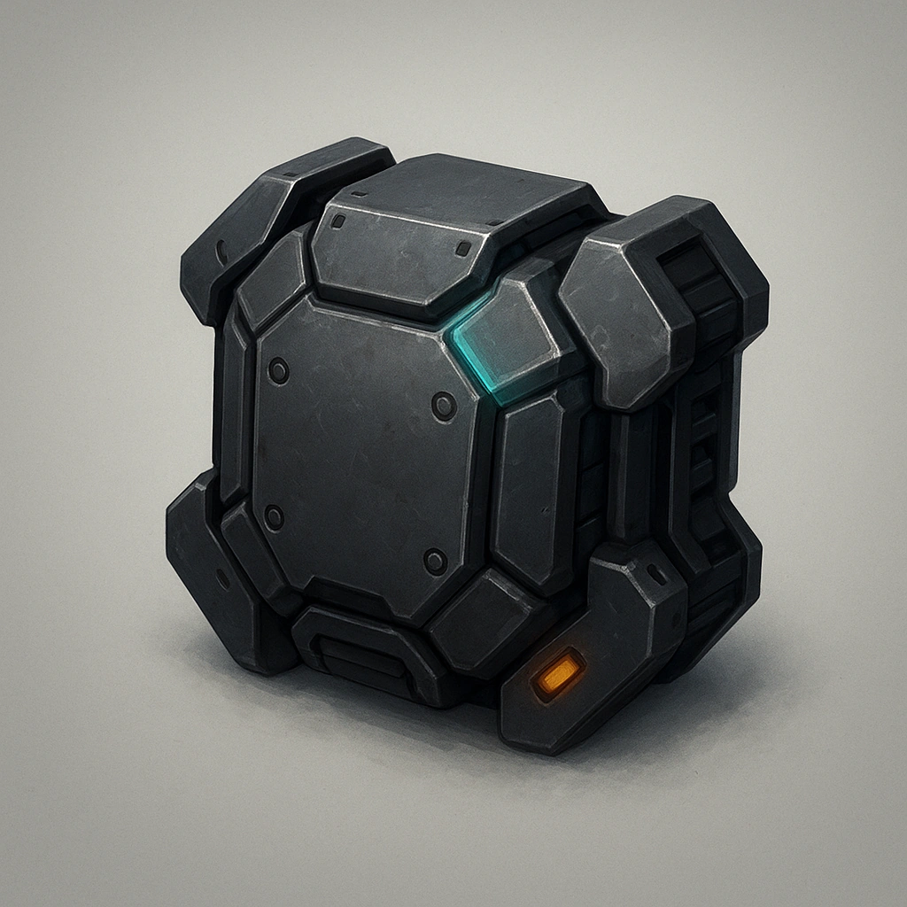

# Primary Drone Base Armor

*
All primary drones start with this level of armor
*

### **Tier: 1**

#### Actions
—

#### Effects
—

drones-devices
 
**UUID:** `Compendium.cybermancy.drones-devices.primary-drone-base-armor`

