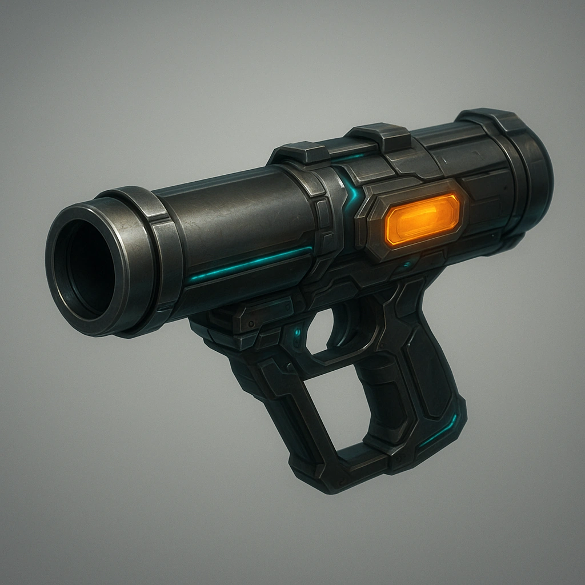

# Rocket launcher

*Place 1 token on this card and remove 1 rocket from your inventory (must be acquired or built during a long rest).  Your Primary Drone now has the ability to launch that rocket as an attack action.*

### **Tier: Tier 3**

#### Actions
—

#### Effects
—

drones-devices/Tier 3
 
**UUID:** `Compendium.cybermancy.drones-devices.rocket-launcher`

