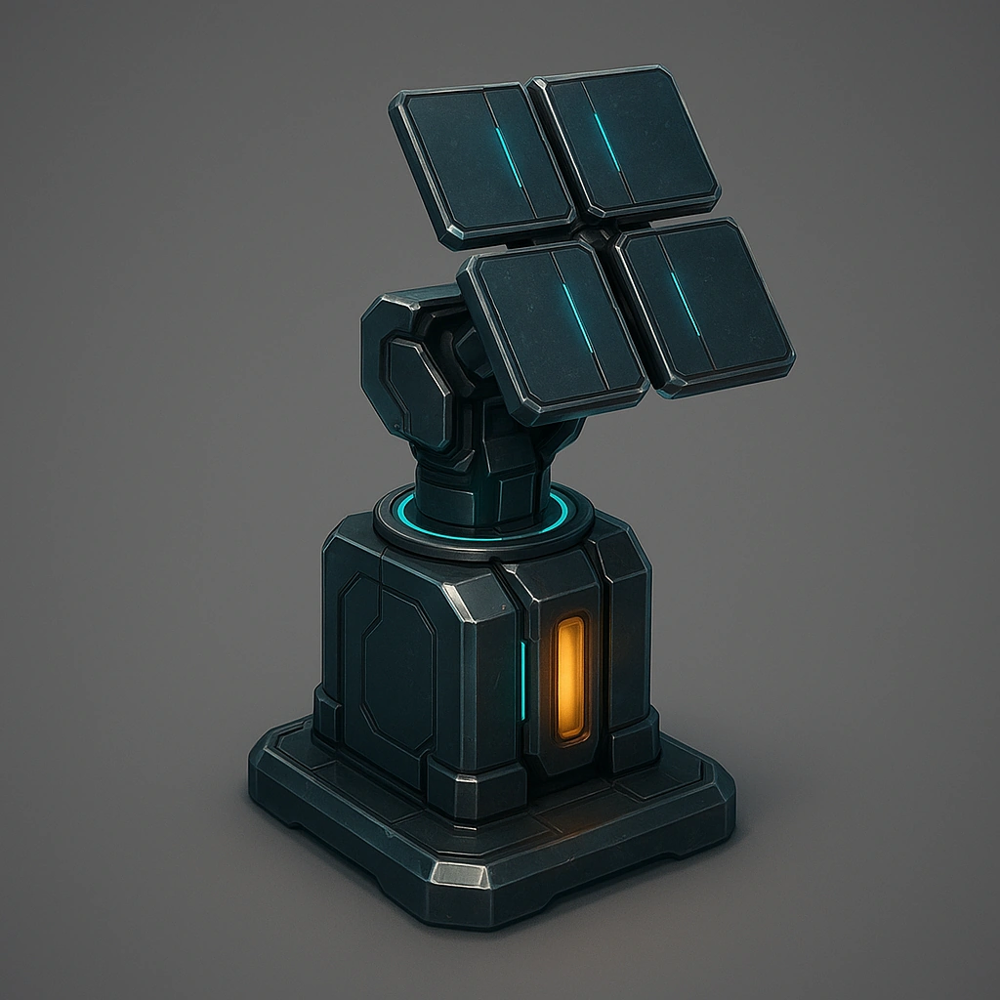

# Signal booster

*Your Primary Drone can now operate anywhere within the Scene and is invulnerable to signal jamming if within Close of you.*

### **Tier: Tier 2**

#### Actions
—

#### Effects
—

drones-devices/Tier 2
 
**UUID:** `Compendium.cybermancy.drones-devices.signal-booster`

