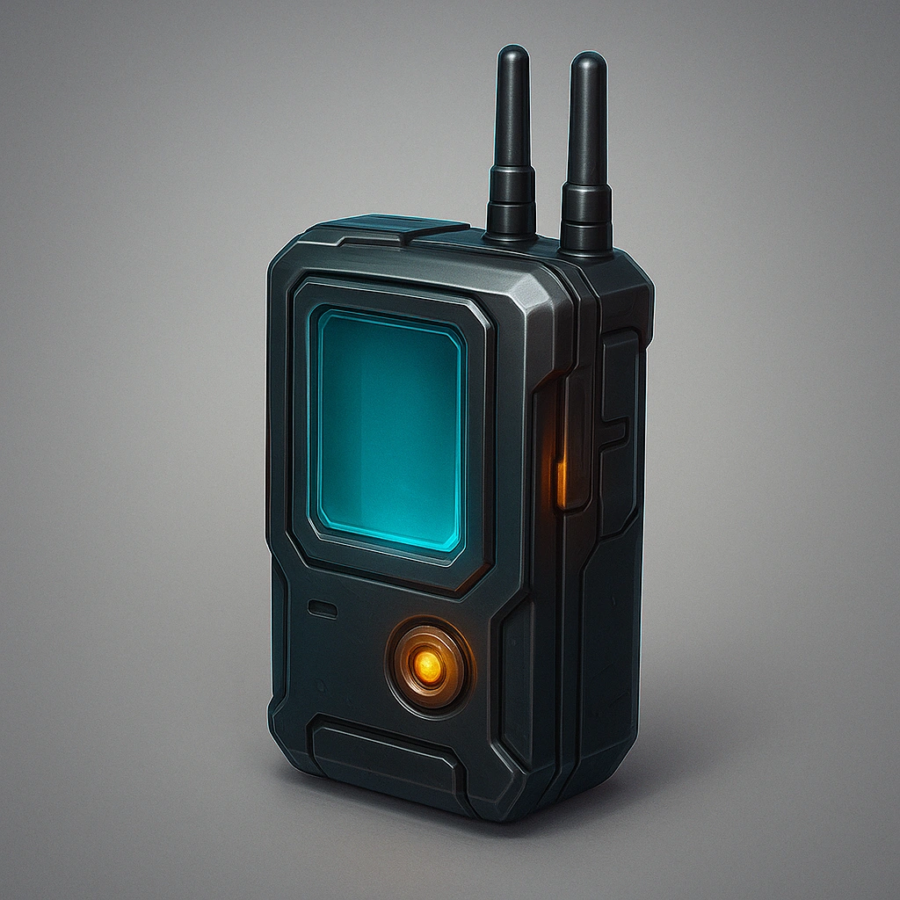

# Signal jammer

*Your Primary Drone gains a signal jammer such that all comms (ally and adversary) within Close are effectively jammed.  All other drones within Very Close can no longer receive signal or commands.*

### **Tier: Tier 2**

#### Actions
—

#### Effects
—

drones-devices/Tier 2
 
**UUID:** `Compendium.cybermancy.drones-devices.signal-jammer`

