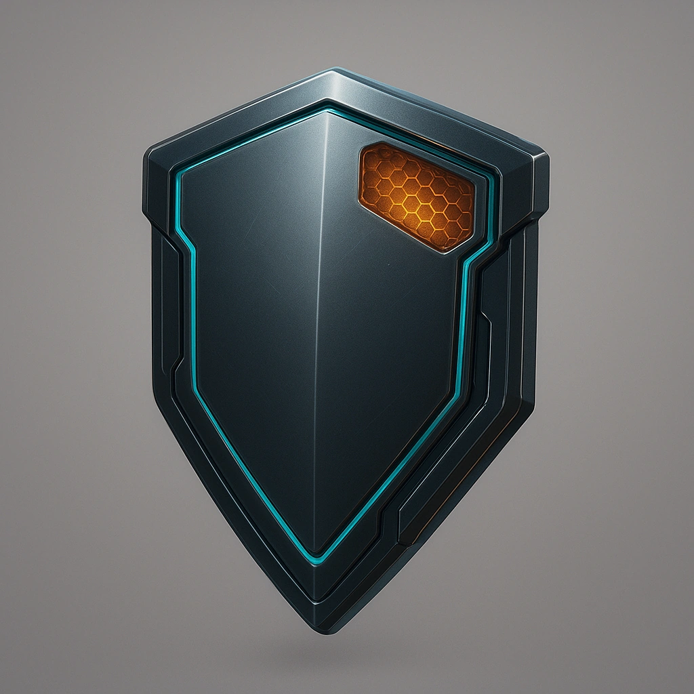

# Stealth shield

*Your Primary Drone gains the ability to trigger the Hidden condition as an action.  That condition persists until it takes any other action.*

### **Tier: Tier 3**

#### Actions
—

#### Effects
—

drones-devices/Tier 3
 
**UUID:** `Compendium.cybermancy.drones-devices.stealth-shield`

