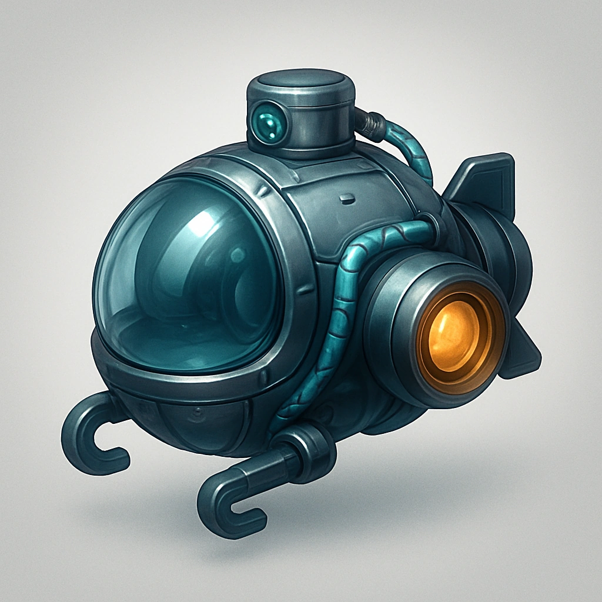

# Submersible

*Your Primary Drone gains a watertight hull and sealed propulsion package enabling limited underwater operation. Supports shallow submersion, periscope comms, and buoyancy control; not rated for deep-sea pressures.*

### **Tier: Tier 1**

#### Actions
—

#### Effects
—

drones-devices/Tier 1
 
**UUID:** `Compendium.cybermancy.drones-devices.submersible`

