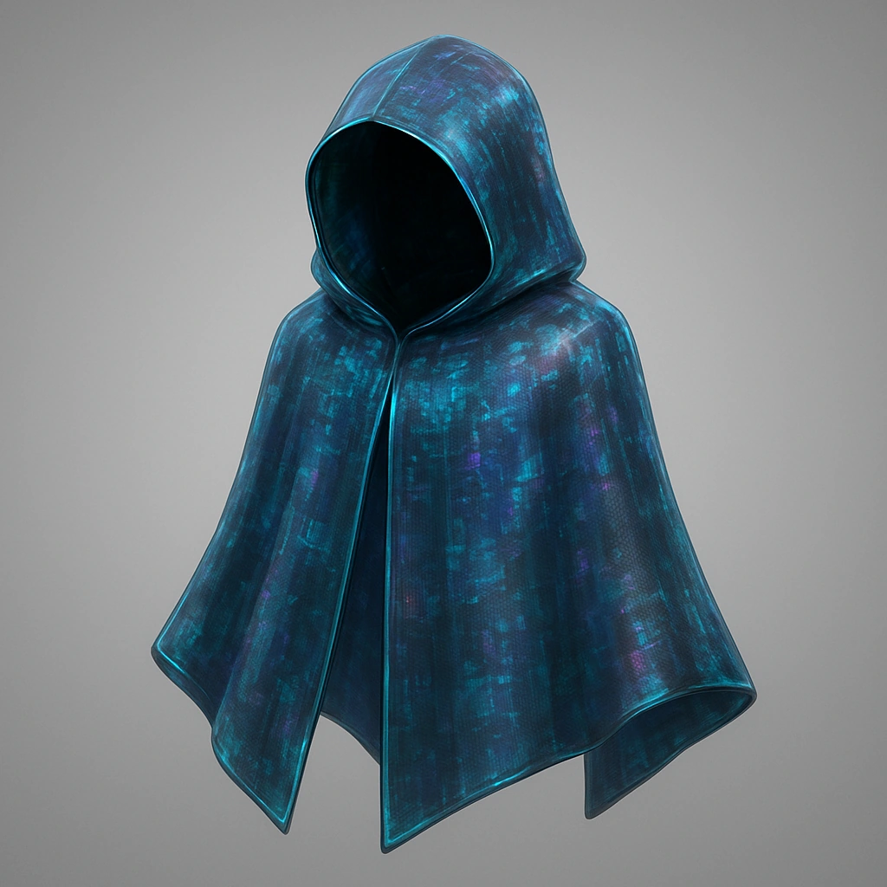

    

    

    
    ### Ghost Ghostweave Cloak
    

    *A creature with a Spellcast trait wearing this cloak can adjust its color, texture, and size at will. blends with urban spectra and sensor noise*
    

    

    

    #### Actions
    —

    #### Effects
    —
    

    

    

    **UUID:** `Compendium.cybermancy.loot.ghost-ghostweave-cloak`
    

    

    