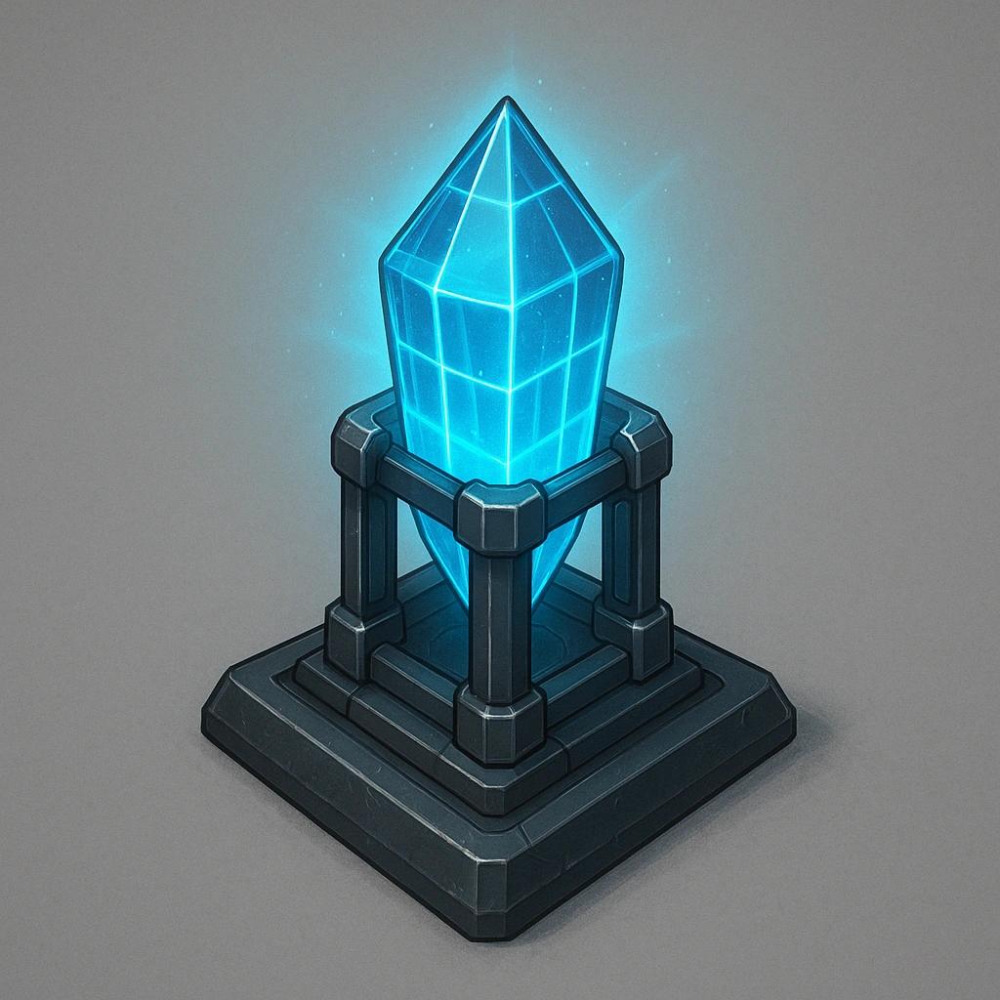

# Grid Arcane Prism Lens

*Position this prism in a location of your choosing and activate it. All allies within Close range of it gain a +1 bonus to their Spellcast Rolls. While activated, the prism can’t be moved. Once the prism is deactivated, it can’t be activated again until your n*

### **Tier: —**

#### Actions
- 
**Activate** **

#### Effects
- 
**Arcane Prism** **

loot
 
**UUID:** `Compendium.cybermancy.loot.grid-arcane-prism-lens`

