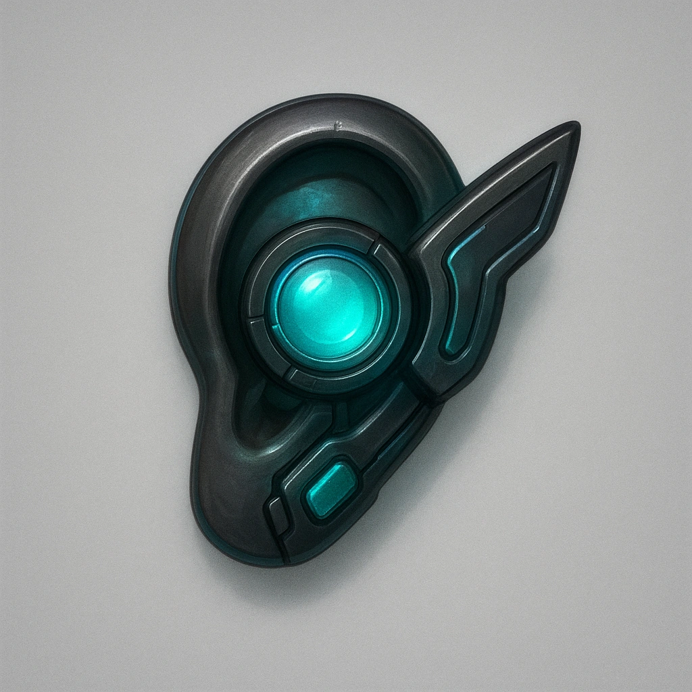

# Mirror Corrector Sprite Mask

*This tiny sprite sits in the curve of your ear canal and whispers helpful advice during combat. Once per short rest, you can gain advantage on an attack roll. black-market tech favored by runners and fixers*

### **Tier: Tier 1**

#### Actions
- 
**Listen** **

#### Effects
—

loot/Tier 1
 
**UUID:** `Compendium.cybermancy.loot.mirror-corrector-sprite-mask`

