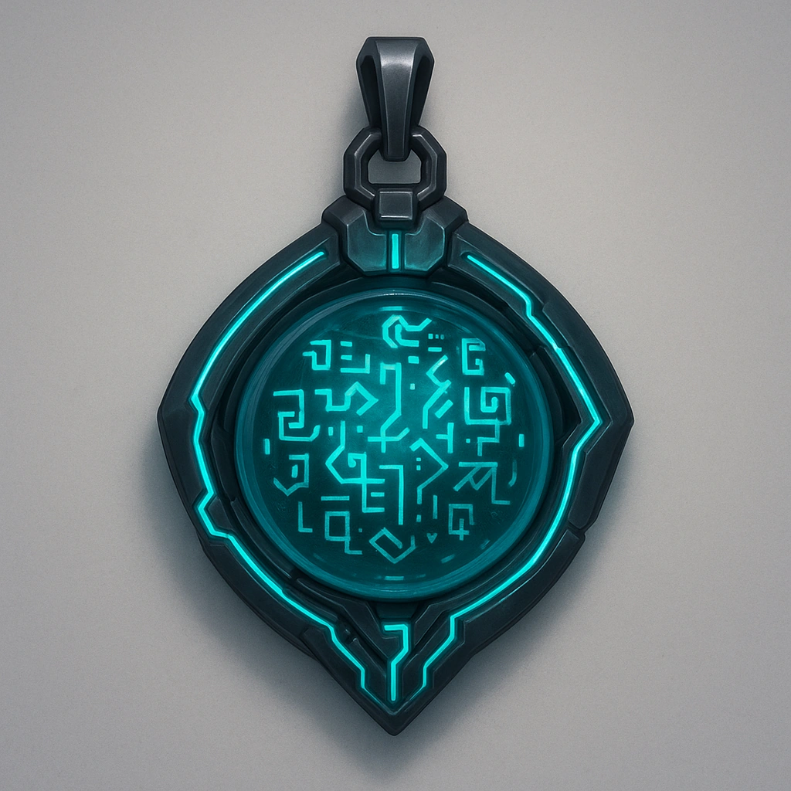

# Zero Quantum Amulet

*Once per long rest, you can activate this amulet to become **Hidden** until you move. While **Hidden** in this way, you remain unseen even if an adversary moves to where they would normally see you. cryptographic sigils route through subdermal coils*

### **Tier: —**

#### Actions
- 
**Activate** **

#### Effects
- 
**Elusive Amulet** *
<span style="color:rgb(239, 230, 216);font-family:Montserrat, sans-serif;font-size:14px;font-style:normal;font-variant-ligatures:normal;font-variant-caps:normal;font-weight:4…*

loot
 
**UUID:** `Compendium.cybermancy.loot.zero-quantum-amulet`

