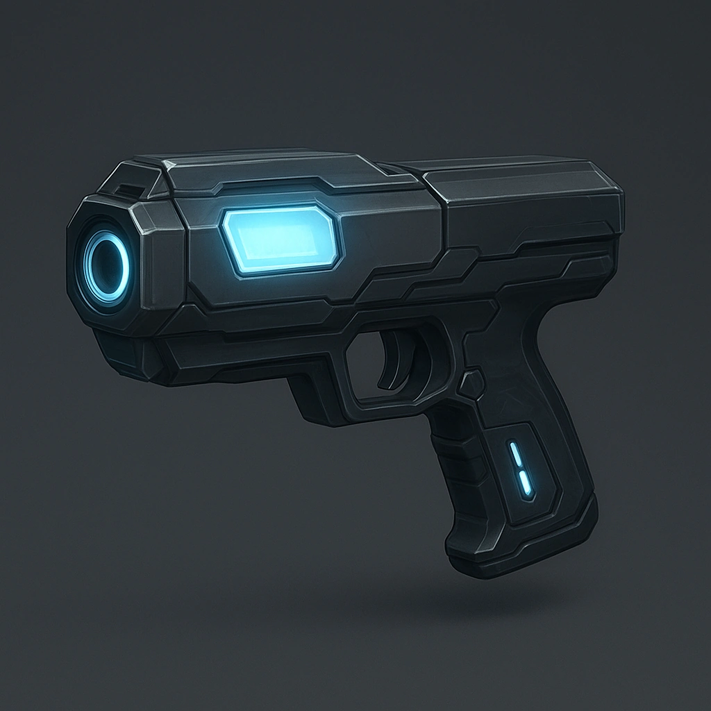

# Adaptive Ballistics Computer

*
Once per scene, <strong>Spend 1 Hope</strong> to attack with advantage
*

### **Tier: —**

#### Actions
—

#### Effects
—

mods
 
**UUID:** `Compendium.cybermancy.mods.adaptive-ballistics-computer`

