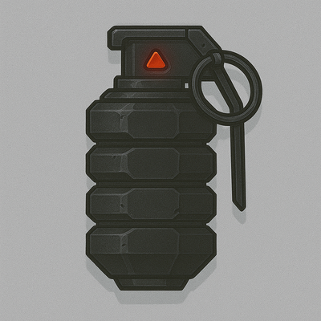

    

### Cluster Grenade

A multi-charge fragmentation device that detonates across several zones at once.

#### Stats
<table class="stat-table">
  <thead><tr><th>Attribute</th><th align="right">Value</th></tr></thead>
  <tbody>
    <tr><td>Tier</td><td align="right">3</td></tr>
    <tr><td>Trait</td><td align="right">Finesse</td></tr>
    <tr><td>Range</td><td align="right">Far</td></tr>
    <tr><td>Burden</td><td align="right">One Handed</td></tr>
    <tr><td>Damage</td><td align="right">d12+6</td></tr>
  </tbody>
</table>

#### Actions
- 
**Fragment Split** *Hit two separate zones.*

- 
**Critical Effect:  Kill Zone** *Full damage in all adjacent zones.*

#### Effects
—

#### Weapon Features
—
[]

---

**UUID:** `Compendium.cybermancy.weapons.cluster-grenade`

