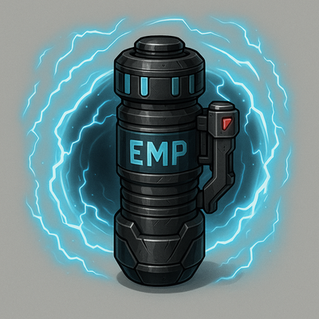

    

### EMP Singularity

A massive EMP charge that disables all systems across multiple networks simultaneously within Very Far range

#### Stats
<table class="stat-table">
  <thead><tr><th>Attribute</th><th align="right">Value</th></tr></thead>
  <tbody>
    <tr><td>Tier</td><td align="right">4</td></tr>
    <tr><td>Trait</td><td align="right">Finesse</td></tr>
    <tr><td>Range</td><td align="right">Far</td></tr>
    <tr><td>Burden</td><td align="right">One Handed</td></tr>
    <tr><td>Damage</td><td align="right">d20</td></tr>
  </tbody>
</table>

#### Actions
- 
**Blackout** *Kill power grid in 1 km radius once per rest.*

- 
**Critical Effect:  System Collapse** *Entire Matrix zone crashes beyond repair.*

#### Effects
—

#### Weapon Features
—
[]

---

**UUID:** `Compendium.cybermancy.weapons.emp-singularity`

