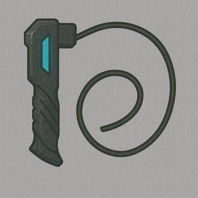

### Improved Monofilament Whip

*A reinforced filament with servo control for higher cutting torque and unmatched lethality.*

#### Stats
<table class="stat-table">
  <thead><tr><th>Attribute</th><th>Value</th></tr></thead>
  <tbody>
    <tr><td>Damage</td><td>d10+4</td></tr>
    <tr><td>Range</td><td>veryClose</td></tr>
    <tr><td>Hands</td><td>oneHanded</td></tr>
  </tbody>
</table>

#### Actions
—

#### Effects
—

#### Weapon Features
—

---

**UUID:** `Compendium.cybermancy.weapons.improved-monofilament-whip`

