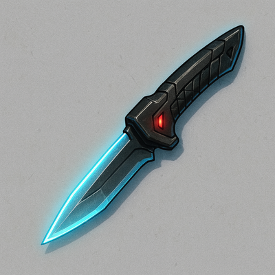

# Improved Vibro-Knife

Precision-tuned vibration edge allows for armor penetration and silent, efficient kills.

#### Stats
<table class="stat-table">
  <thead><tr><th align="left">Attribute</th><th align="right">Value</th></tr></thead>
  <tbody>
    <tr><td>Tier</td><td align="right">2</td></tr>
    <tr><td>Trait</td><td align="right">Agility</td></tr>
    <tr><td>Range</td><td align="right">Melee</td></tr>
    <tr><td>Burden</td><td align="right">One Handed</td></tr>
    <tr><td>Damage</td><td align="right">d8+5</td></tr>
  </tbody>
</table>

#### Actions
- 
**Piercing** *

Target cannot Mark An Armor Slot to reduce Minor damage to No damage.*

- 
**Critical Effect:  Assassins Cut** *

If you were Hidden when making this attack, target must Mark 1 additional Hit Point and gains Incapacitated condition (cannnot make actions, movement, or reactions)*

#### Effects
—

#### Weapon Features
—
[]

---

**UUID:** `Compendium.cybermancy.weapons.improved-vibro-knife`
weapons/Tier 2
 

