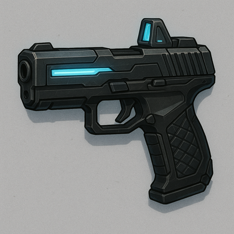

# Smartpistol Mk II

Improved ballistic computer with predictive recoil compensation and infrared tracking.  NOTE: must be paired with SmarkLink™ CPU Implant, otherwise is just a Heavy Semi-automatic Pistol.

#### Stats
<table class="stat-table">
  <thead><tr><th align="left">Attribute</th><th align="right">Value</th></tr></thead>
  <tbody>
    <tr><td>Tier</td><td align="right">2</td></tr>
    <tr><td>Trait</td><td align="right">Finesse</td></tr>
    <tr><td>Range</td><td align="right">Far</td></tr>
    <tr><td>Burden</td><td align="right">One Handed</td></tr>
    <tr><td>Damage</td><td align="right">d6+5</td></tr>
  </tbody>
</table>

#### Actions
- 
**Smartlink** *

If paired with the SmarkLink™ CPU Implant, Spend a Hope, reroll one Destiny die.*

- 
**Critical Effect:  Eye Shot** *

Target cannot use Armor to reduce this damage. Target gets the Blinded condition (target cannot see, attacks against target have advantage, target's attacks have disadvantage) until GM spotlights AND Spends 1 Fear.*

#### Effects
—

#### Weapon Features
—
[]

---

**UUID:** `Compendium.cybermancy.weapons.smartpistol-mk-ii`
weapons/Tier 2
 

