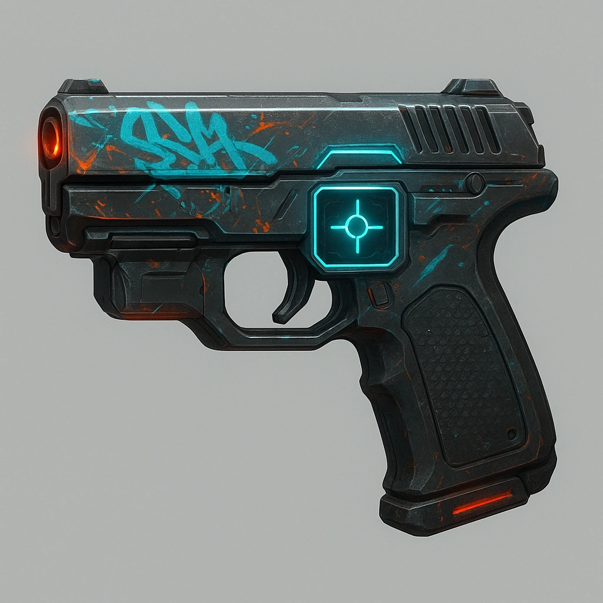

# Smartpistol

Compact sidearm with digital targeting and auto-adjust systems, favored by professional runners. NOTE: must be paired with SmarkLink™ CPU Implant, otherwise is just a Light Semi-automatic Pistol.

#### Stats
<table class="stat-table">
  <thead><tr><th align="left">Attribute</th><th align="right">Value</th></tr></thead>
  <tbody>
    <tr><td>Tier</td><td align="right">1</td></tr>
    <tr><td>Trait</td><td align="right">Finesse</td></tr>
    <tr><td>Range</td><td align="right">Far</td></tr>
    <tr><td>Burden</td><td align="right">One Handed</td></tr>
    <tr><td>Damage</td><td align="right">d6+2</td></tr>
  </tbody>
</table>

#### Actions
- 
**Smartlink** *

If paired with the SmarkLink™ CPU Implant, Spend a Hope, reroll one Destiny die.*

- 
**Critical Effect:  Pinpoint** * disable 1 weapon or attack until GM spotlights AND Spends 1 Fear.*

#### Effects
—

#### Weapon Features
—
[]

---

**UUID:** `Compendium.cybermancy.weapons.smartpistol`
weapons/Tier 1
 

