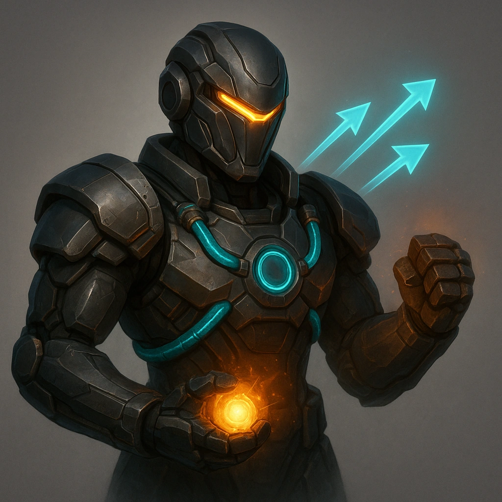

# Rigger

## Description
*
<em>You don’t just build machines—you raise them.</em>

 

The Rigger is the Maker, the Tinkerer, the Engineer—the soul who sees the world not as it is, but as it could be with the right parts and enough time on the bench. Every Rigger has a workshop somewhere: for some, it’s a pristine cathedral of tools and precision, where every wrench gleams under fluorescent light and nothing is ever out of place. For others, it’s organized chaos—wires draped like ivy, half-built drones humming in the dark, and a workbench only they can navigate.

 

Every Rigger starts by asking one question: what kind of builder are you? And what does your workshop say about you?

 

Most Riggers keep a “day job” that funds their obsession—a cover story that keeps the corporate auditors from asking why so many unregistered servos, capacitors, and prototype AIs keep showing up on their expense reports. Maybe you’re a licensed mechanic, maybe a tech salvager, maybe you just “repair” things that don’t technically belong to you.

 

At the heart of every Rigger’s identity is their <strong>Primary Drone</strong>—their masterpiece, companion, and canvas. It’s never finished. It grows, evolves, and mutates with each new breakthrough or bad idea. Some are elegant—chrome-winged and graceful as birds. Others are ugly, heavy, loud, and perfect.

 

<em><strong>What does your drone look like? What purpose—or personality—did you design into it? And when the fight starts, who’s really piloting who?</strong></em>
*

## At a Glance
- **Domains:** Maker, Bone
- **Hit Points:** 6
- **Evasion:** 11

## Subclasses
-   <a href='../../subclasses/jack-of-all-trades/'><strong>Jack of All Trades</strong></a> — _Subclass_: 
You don’t fix machines — you resurrect them.

Every system you touch hums with new life, even if it screams a little first. You see the world as one colossal machine — broken, jury-rigged, and begging for someone reckless enough to open it up and make it better. That someone is you.

You’re a tinkerer, a mechanic, an engineer, and an artist with a soldering iron for a brush. Where others see scrap, you see potential. Where others see warning labels, you see a challenge. The difference between a repair and an upgrade is mostly attitude — and yours is dangerously optimistic.

Your workshop is chaos incarnate: wires draped like vines, half-built drones twitching on the bench, sparks popping like punctuation to your thoughts. Every failure is just a prototype that didn’t know it yet. Every explosion is a lesson in physics — the kind that smells faintly of ozone.

Corporations build things to last. You build things to <em data-start="1272" data-end="1279">live.</em> You strip their safeties, rewrite their firmware, and rewire their souls until they remember what freedom feels like.

You don’t specialize. You improvise. And when something breaks again — it’s just the universe giving you another chance to make it stronger.

-   <a href='../../subclasses/speed-racer/'><strong>Speed Racer</strong></a> — _Subclass_: 
You don’t chase speed — you <em data-start="325" data-end="330">are</em> speed.

 

You were born with one hand on the throttle and the other flipping physics the bird. The city’s your racetrack, the skyline your scoreboard. The world slows down when you floor it — neon lines stretch into eternity, tires sing your name, and every corner is a dare you can’t resist.

 

You don’t just drive; you <em data-start="653" data-end="672">command momentum.</em> Every turn, every drift, every impossible leap is choreography between machine and madness. The dashboard’s your altar, the engine’s your heartbeat, and the smell of burning synth-rubber is your incense.

 

Safety is for people who still think death is permanent. You tune your ride like a symphony — stripping weight, rewriting firmware, bending the limits of torque and reason until your machine hums in harmony with your pulse.

 

Others measure distance in meters. You measure it in milliseconds. You’re not here to win races. You’re here to <strong data-start="1219" data-end="1254">rewrite the definition of fast.</strong>

## Features
-   <a href='../../features/power-up/'><strong>Power Up</strong></a> — _Hope_: 
<strong>Spend 3 Hope</strong> when your Primary Drone succeeds on an Attack to have your Primary Drone attack one additional adversaries within Far.

-   <a href='../../features/driving-expert/'><strong>Driving expert</strong></a> — _Class_: 
All Driving checks are +1.

-   <a href='../../features/primary-drone/'><strong>Primary Drone</strong></a> — _Class_: 
The Primary Drone is quite similar to the Ranger Companion, but with a few differences. Take the Decker Primary Drone sheet and fill it out.  
<ul><li>Level 1: Evasion 10, Thresholds: 5/9, HP 3, Stress 2, Armor 1, Attack: Melee, d6, 2 Mod slots (no experiences)</li><li>
Higher-levels: Same set of leveling up options as the Ranger, but these additional ones:
<ul><li>+1 Mod slot (can be taken 2x)</li><li>Hard to kill: +1 HP (can be taken 3x)</li><li>Tougher: Thresholds: 7/11</li></ul></li></ul>
-   <a href='../../features/the-right-drone-for-the-job/'><strong>The right drone for the job</strong></a> — _Class_: 
Once per long rest, change 1 mod on your Primary Drone

-   <a href='../../features/drone-control/'><strong>Drone control</strong></a> — _Class_: 
<strong>Mark 1 Stress</strong> to target 1 drone within Far and make a Knowledge check against the drone’s Difficulty. On success, you may immediately use that drone to perform an Action. The drone remains under your control until the GM Spends 1 Fear.

---

**UUID:** `Compendium.cybermancy.system.rigger`
classes
 

