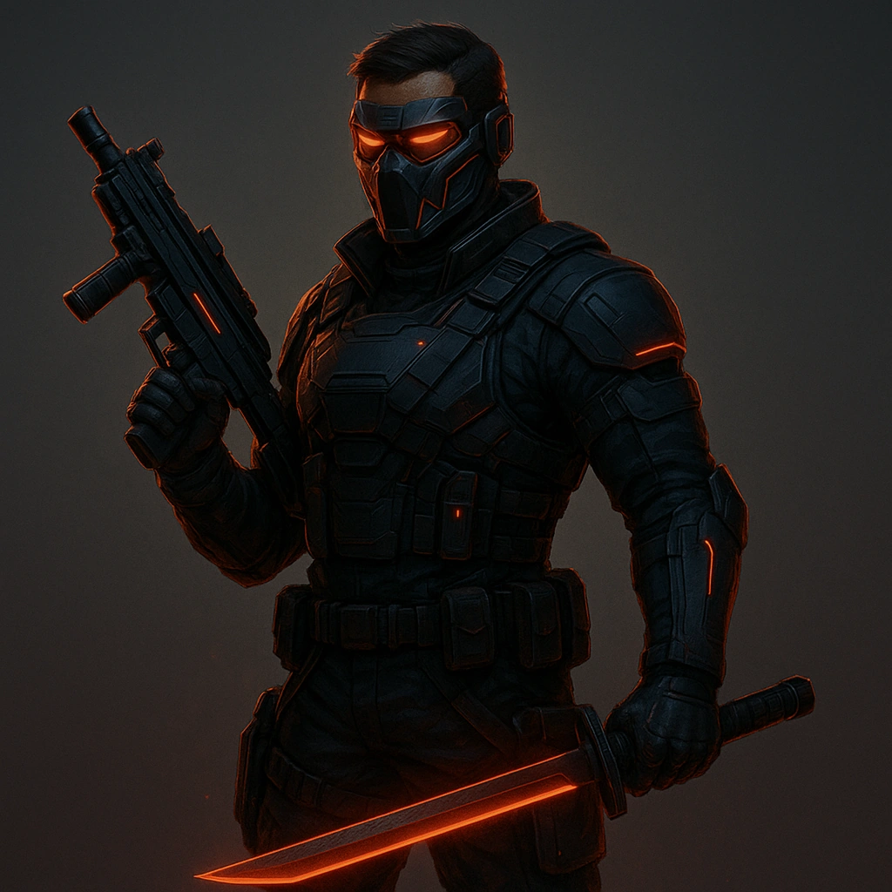

# Street Samuri

## Description
*
<em>Steel is honest. Flesh lies.</em>

You walk the line between the old world’s honor and the new world’s circuitry.

Some call you a mercenary, some a relic — they’re both right. You move through the sprawl like a storm wrapped in human skin: clean, efficient, and devastatingly precise. The Street Samurai doesn’t talk about strength; they demonstrate it.

Your body is a weapon — sculpted, reforged, upgraded, and tuned past the edge of human tolerance. Every scar is a story, every implant a lesson bought in blood and chrome. You’ve seen what happens when code and conscience mix: it’s not pretty. That’s why you live by your own code — maybe ancient, maybe self-written, but always yours.

Corporations build armies; gangs build legends. You build reputation. You fight because someone has to — and because deep down, you still believe that mastery of the blade, the gun, or the body means something in a world that’s sold its soul to machines.

Some Street Samurai operate like ghosts, silent and unseen until the moment of violence. Others are thunder — explosive, unstoppable, and poetic in destruction. Neither path is wrong. Both are beautiful.

What weapon have you made an extension of yourself? What line will you never cross — and what happens when someone makes you?
*

## At a Glance
- **Domains:** Blade, Bullet
- **Hit Points:** 7
- **Evasion:** 9

## Subclasses
-   <a href='../../subclasses/mercenary/'><strong>Mercenary</strong></a> — _Subclass_: 
<em>You don’t fight for free—but you always fight for something.</em>

 

You are the weapon that other weapons dream of becoming. You’ve mastered every trigger, every blade, every angle of lethality that the modern world can manufacture. Guns, swords, drones, fists — it doesn’t matter. In your hands, everything becomes a tool of precision and inevitability.

 

You didn’t choose this life; you refined it. Maybe you came from the military, the corps’ private armies, or one of the syndicates where “promotion” is measured in blood. Maybe you just learned early that violence pays better than honesty. Either way, you’re a professional now — calm under fire, fluent in fear.

 

You don’t kill for fun. You kill for <em>order</em>. For <em>balance</em>. For the code you’ve written into your bones — the rules that keep you from becoming the monsters you hunt for a paycheck.

 

Every job starts with three questions: <em>Who’s paying? What’s the risk? And can you still look in the mirror afterward?</em>

 

If the answers don’t matter anymore… maybe it’s time to hang up the gun.

-   <a href='../../subclasses/bodyguard/'><strong>Bodyguard</strong></a> — _Subclass_: 
Your loyalty is your armor. Your purpose is protection.

 

You stand between chaos and the one who hired you — a wall of muscle, will, and immaculate reflexes. You’re not just a shield; you’re the counterattack that happens before anyone even realizes they’ve made a mistake.

 

You read rooms like battlegrounds. You count exits without looking. You memorize heartbeats. The people you protect might never know how close they came to dying — and that’s how you like it.

 

You don’t protect because you’re paid to. You protect because it gives you meaning. In a city that sells everything, loyalty’s the one currency that still has value — and yours is priceless.

 

When the bullets start flying, you don’t dive for cover. You <em data-start="2990" data-end="2995">are</em> the cover.

## Features
-   <a href='../../features/focused-aggression/'><strong>Focused aggression</strong></a> — _Hope_: 
<strong>Spend 3 Hope</strong> to gain +2 to either all attacks made by Melee weapons or all attacks made by guns until the end of the Scene.

-   <a href='../../features/quick-reflexes/'><strong>Quick reflexes</strong></a> — _Class_: 
As a Reaction, when you are about to be attacked at Melee range and are wielding a Melee weapon, <strong>Mark 1 Stress</strong> to make an Attack on the would-be attacker first.

-   <a href='../../features/dual-wielding/'><strong>Dual wielding</strong></a> — _Class_: 
If you are wielding a Melee weapon and gun (both of which must be one-handed), <strong>Spend 3 Hope</strong> to make an attack with each against different targets. =

---

**UUID:** `Compendium.cybermancy.system.street-samuri`
classes
 

