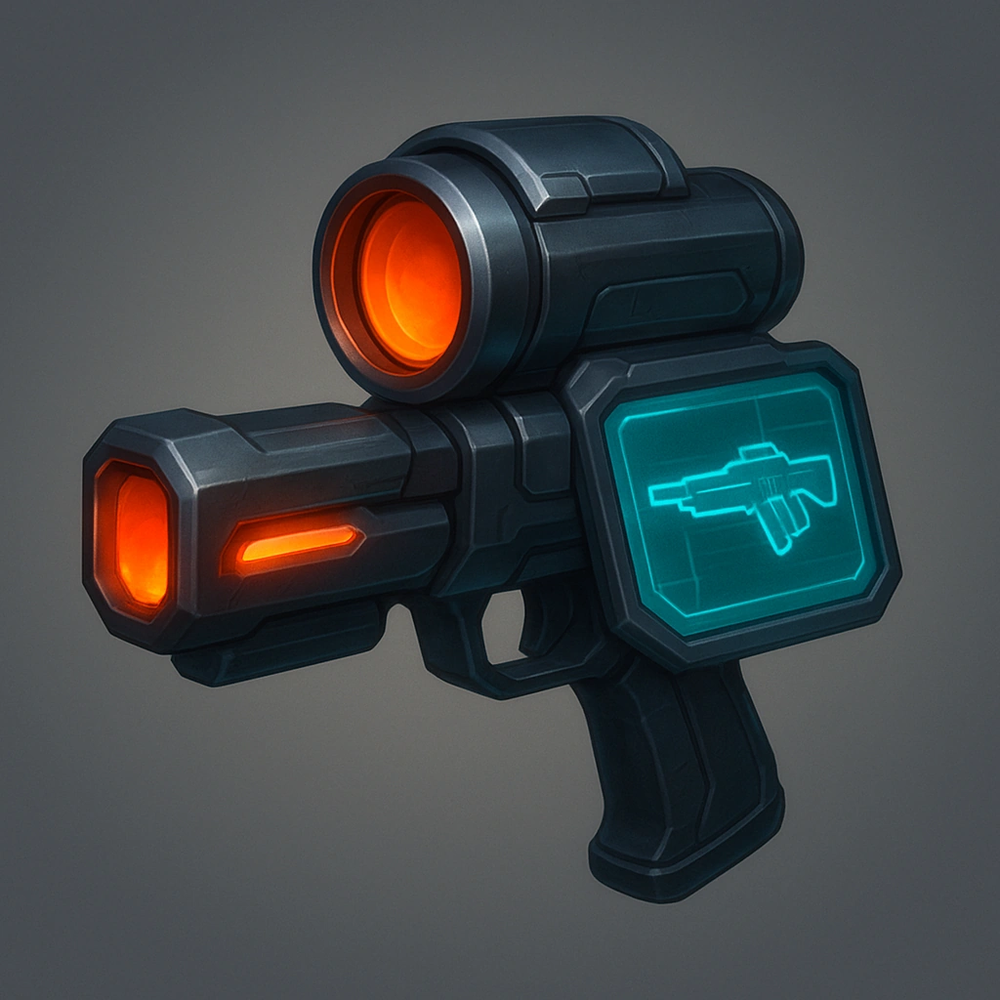

# Assess Weapon
## Bullet

## Description
<i>Every gun tells a story.</i>
Identify the weapon type and potential weaknesses or modifications of one visible gun within Far

<table class="stat-table">
  <thead><tr><th>Attribute</th><th align="right">Value</th></tr></thead>
  <tbody>
    <tr><td>Type</td><td align="right">Ability</td></tr>
    <tr><td>Level</td><td align="right">1</td></tr>
    <tr><td>Recall Cost</td><td align="right">0</td></tr>
  </tbody>
</table>

## Actions
- 
**Assess Weapon** *Every gun tells a story.Identify the weapon type and potential weaknesses or modifications of one visible gun within Far*

---

domains/Bullet/1
 
**UUID:** `Compendium.cybermancy.system.assess-weapon`

