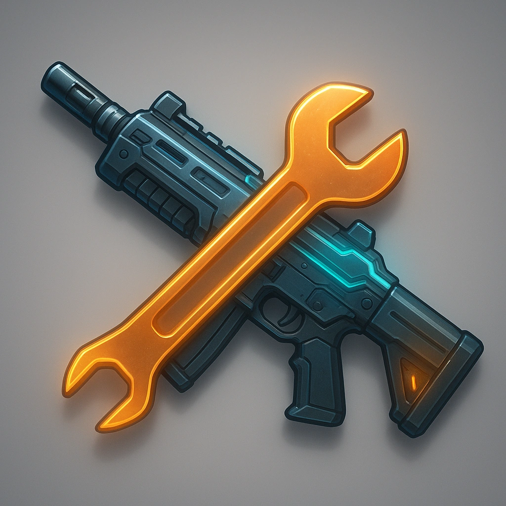

# Good Maintenance
## Maker

## Description
<i>A well-oiled machine never quits.</i>
Your weapons and <b>Primary Drone</b> cannot malfunction except through magical effects.

<table class="stat-table">
  <thead><tr><th>Attribute</th><th align="right">Value</th></tr></thead>
  <tbody>
    <tr><td>Type</td><td align="right">Ability</td></tr>
    <tr><td>Level</td><td align="right">6</td></tr>
    <tr><td>Recall Cost</td><td align="right">1</td></tr>
  </tbody>
</table>

## Actions
- 
**Good Maintenance** *A well-oiled machine never quits.Your weapons and Primary Drone cannot malfunction except through magical effects.*

---

domains/Maker/6
 
**UUID:** `Compendium.cybermancy.system.good-maintenance`

