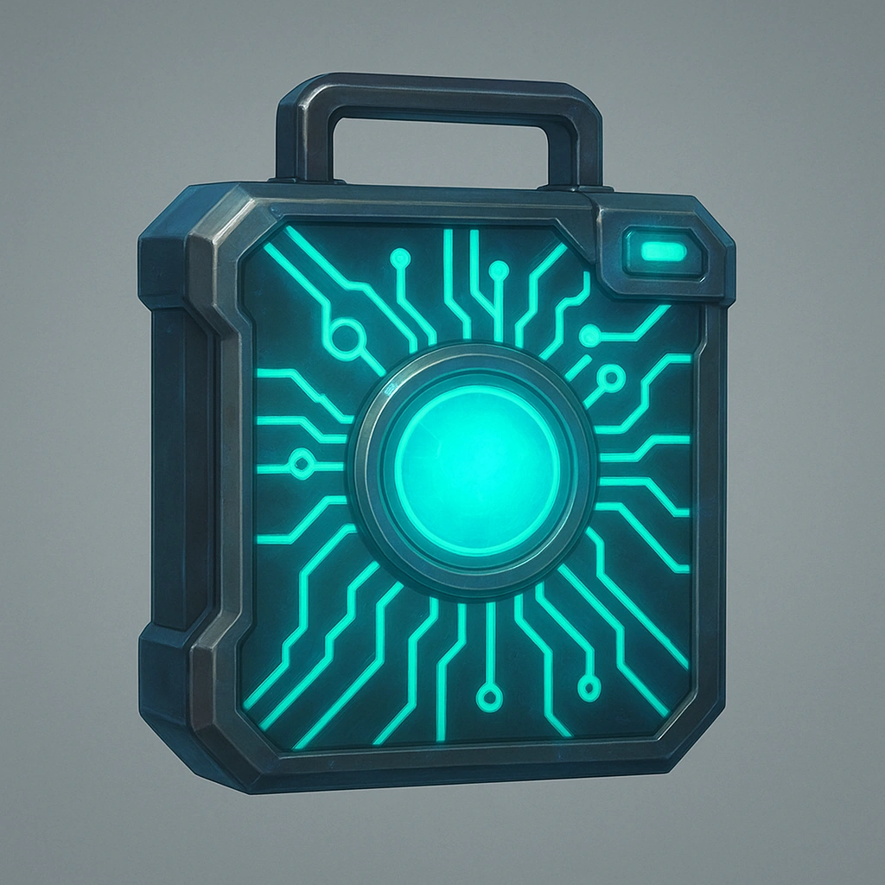

# Strobe Effect
## Circuit

## Description

<em>“Flash ’em, crash ’em, and walk out glowing.”</em>

<strong>Mark 1 Stress</strong> and cause a Device you have Infiltrated or Controlled to generate a distration. Until the GM spends 1 Fear to cancel the Strobe Effect, all adversaries within Close of the Device, have disadvantage on all actions and attacks.

<table class="stat-table">
  <thead><tr><th>Attribute</th><th align="right">Value</th></tr></thead>
  <tbody>
    <tr><td>Type</td><td align="right">Ability</td></tr>
    <tr><td>Level</td><td align="right">2</td></tr>
    <tr><td>Recall Cost</td><td align="right">1</td></tr>
  </tbody>
</table>

## Actions
- 
**Strobe Effect** *“Flash ’em, crash ’em, and walk out glowing.”Spend 1 Hope to use your Reaction to make a Device you have Infiltrated or Controlled successfully generate a distration.  The creature must spend 1 Fear to take their next Action and they have disadvantage if they attack with their next action.*

---

domains/Circuit/2
 
**UUID:** `Compendium.cybermancy.system.strobe-effect`

