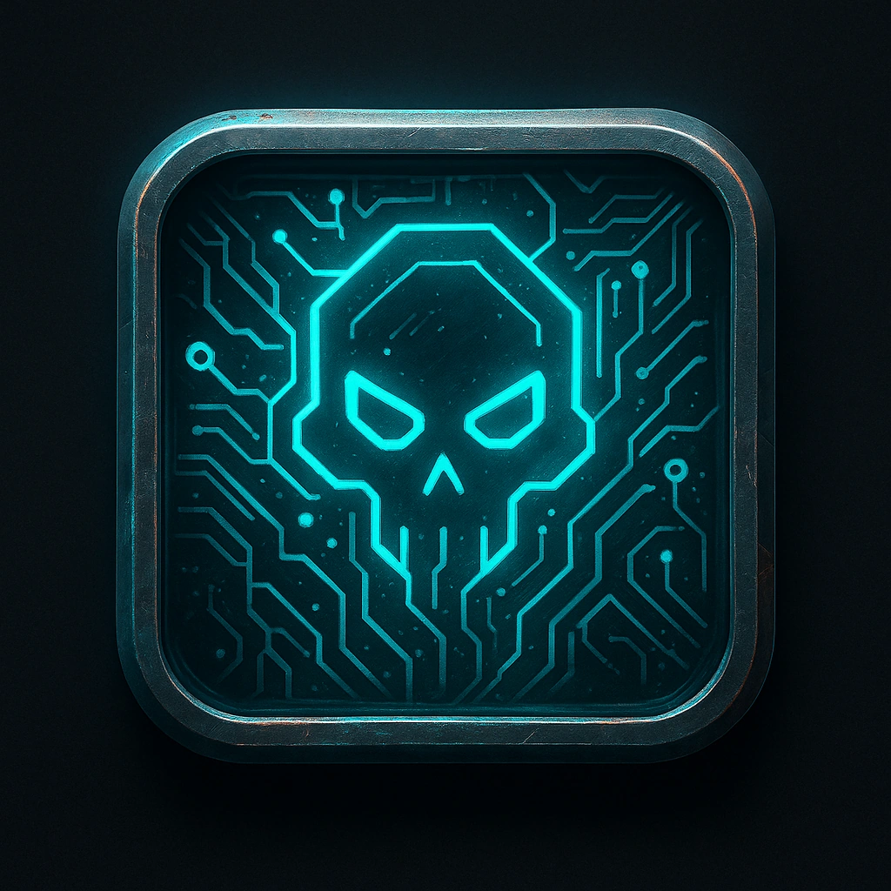

# Ash Cloud

## Description
*
<em>You move blind through data smoke and security ghosts.</em>  

Start a Countdown Clock (4)

 

Spend 1 Fear to advance the Countdown Clock and advance the System Alert level by the value of the Countdown Clock. As a Reaction, a hacker can make a Spellcasting (Hacking) check against the Difficulty of this ICE to prevent the System Alert level advancing.

 

When the Countdown Clock is complete, the ICE deactivates.
*

## Actions
- 
**Ash Cloud** *You move blind through data smoke and security ghosts.

Start a Countdown Clock (4)

Spend 1 Fear to advance the Countdown Clock and advance the System Alert level by the value of the Countdown Clock.  As a Reaction, a hacker can make a Spellcasting (Hacking) check against the Difficulty of this ICE to prevent the System Alert level advancing.

When the Countdown Clock is complete, the ICE deactivates.*

---

features/Device Features/Wall ICE
 
**UUID:** `Compendium.cybermancy.system.ash-cloud`

