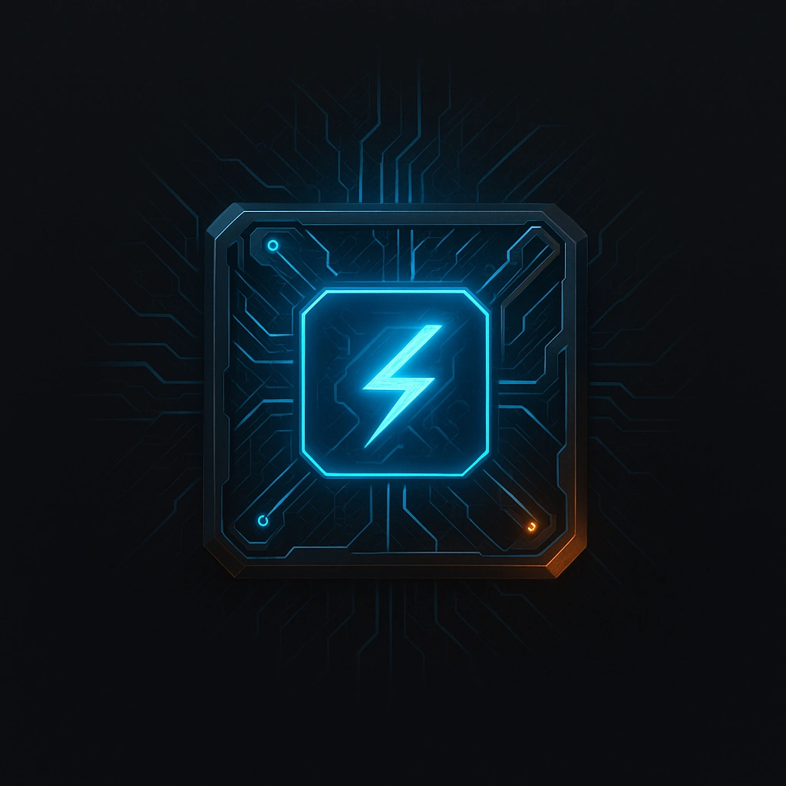

# Black ICE

## Description
*
<em>It doesn’t defend the system—it defends itself.</em>  

While this ICE is active, a hacker must mark 1 Stress to perform any Infiltration or Control actions on this device.

Spend 1 Fear to do 1 HP of direct damage to the hacker.

*

## Actions
- 
**Black ICE** *It doesn’t defend the system—it defends itself.

While this ICE is active, a hacker must mark 1 Stress to perform any Infiltration or Control actions on this device.

Spend 1 Fear to do 1 HP of direct damage to the hacker.*

- 
**Damage** **

---

features/Device Features/Sentry ICE
 
**UUID:** `Compendium.cybermancy.system.black-ice`

