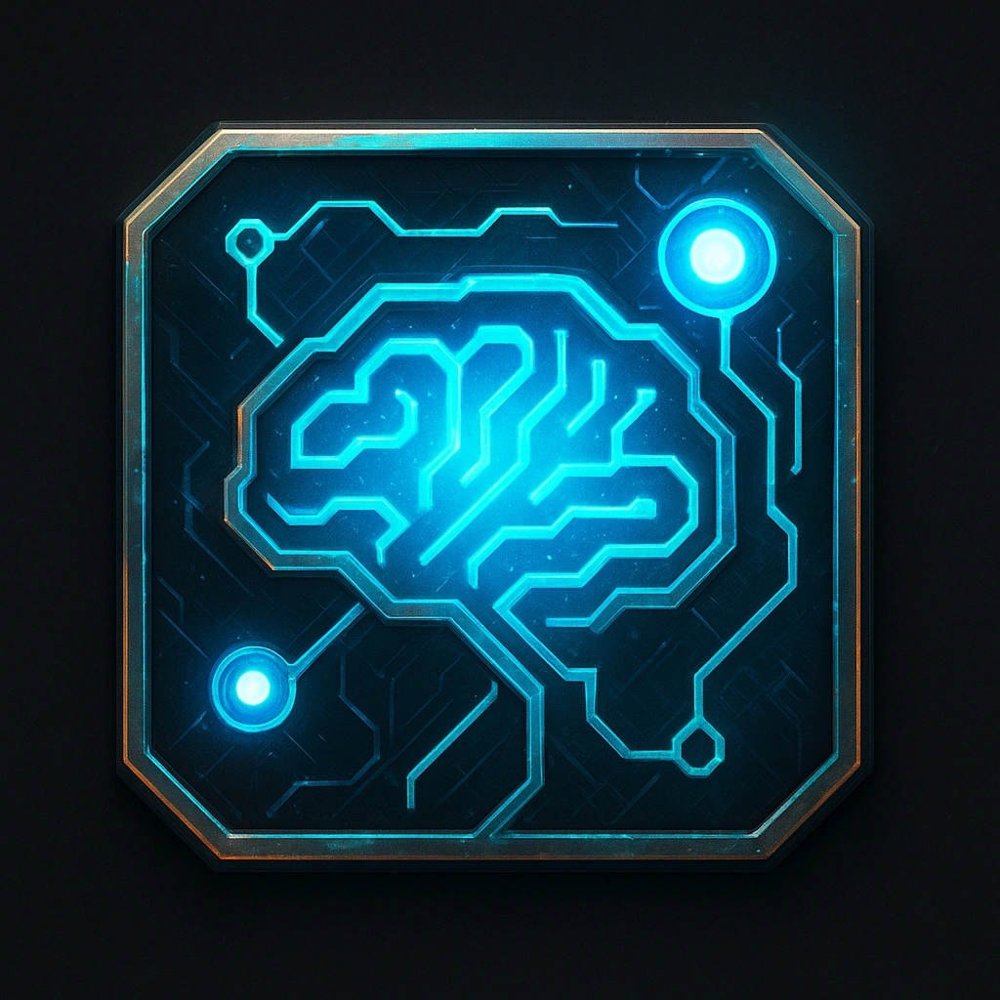

# Brainstorm

## Description
*
<em>Every sound becomes light. Every color screams.</em>  

On first contact, floods your neural link with raw sensory data

<em>Every sound becomes light. Every color screams.</em> 

On first contact, floods your neural link with raw sensory data, as a Reaction roll Spellcasting (Hacking) at the difficulty of this device or Mark 1 Stress immediately.

Mark 1 Stress on any failed Spellcasting (Hacking) roll or Success with Fear outcome until this ICE is disabled.
*

## Actions
- 
**Brainstorm** *Every sound becomes light. Every color screams.

On first contact, floods your neural link with raw sensory data; roll Fear or mark Stress.*

- 
**Brainstorm** *Every sound becomes light. Every color screams.

On first contact, floods your neural link with raw sensory data, as a Reaction roll Spellcasting (Hacking) at the difficulty of this device or Mark 1 Stress immediately.

Mark 1 Stress on any failed Spellcasting (Hacking) roll or Success with Fear outcome until this ICE is disabled.*

---

features/Device Features/Sentry ICE
 
**UUID:** `Compendium.cybermancy.system.brainstorm`

