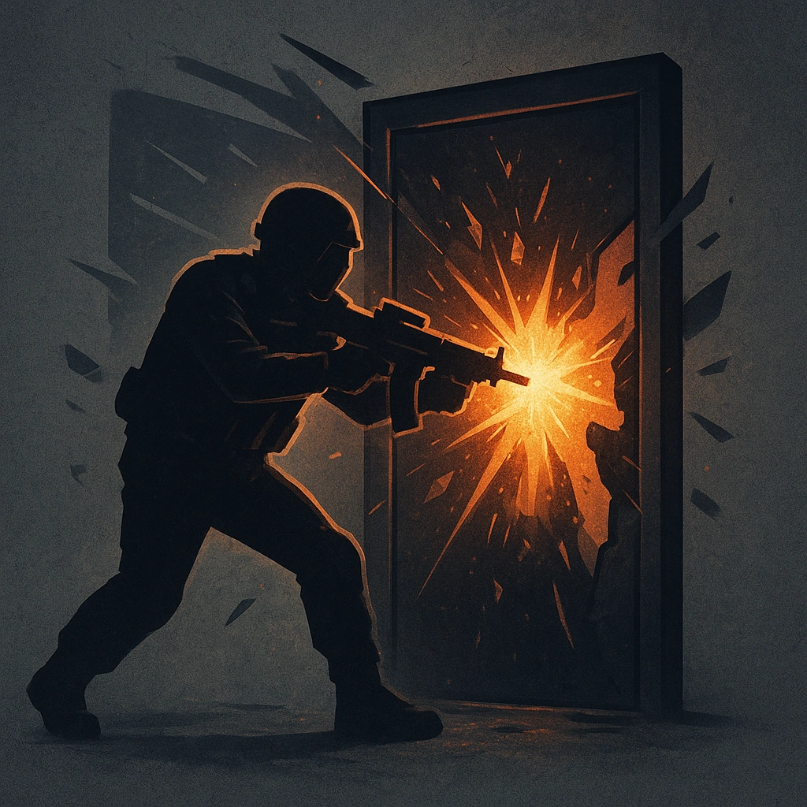

# Breach and Clear

## Description
*
Spend 2 Fear. Jax moves to Close range and immediately spotlights one other Dead Current member.
*

## Actions
—

---

features/Adversary Features
 
**UUID:** `Compendium.cybermancy.system.breach-and-clear`

