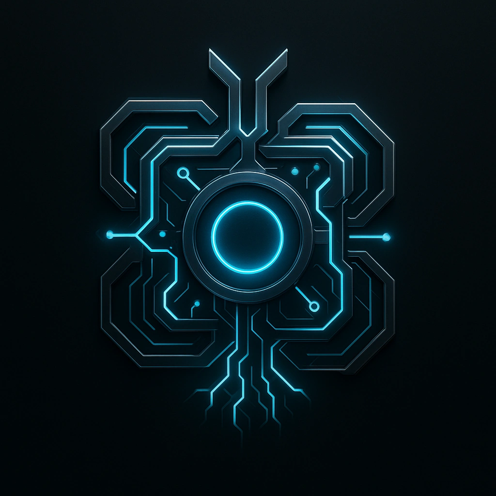

# Eclipse Wall

## Description
*
<em style="box-sizing:border-box;scrollbar-width:thin;scrollbar-color:var(--color-scrollbar) var(--color-scrollbar-track)">The world outside goes silent—you’re inside the machine now.</em>

 The cognitive dissonance created by interacting with this ICE results in -2 on Evasion until you break this subroutine or disengage from the Device.
*

## Actions
- 
**Consuming Digital Veil** *The world outside goes silent—you’re inside the machine now.

The cognitive dissonance created by interacting with this ICE results in -2 on Evasion until you break this subroutine or disengage from the Device.*

---

features/Device Features/Wall ICE
 
**UUID:** `Compendium.cybermancy.system.eclipse-wall`

