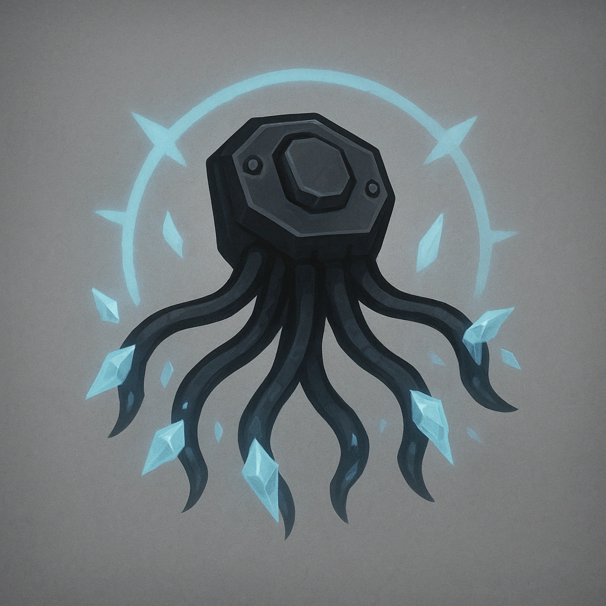

# Entangle

## Description
*
A net drops explosively from the ceiling entangling all creatures within Close.All creatures within Close must make a Reaction check against the Difficulty of this device or else be <em style="box-sizing:border-box;scrollbar-width:thin;scrollbar-color:var(--color-scrollbar) var(--color-scrollbar-track)">Restrained</em>
*

## Actions
- 
**Entangle** *A net drops explosively from the ceiling entangling all creatures within Close.

All creatures within Close must make a Reaction check against the Difficulty of this device or else be Restrained*

---

features/Device Features/Intrinsic Features
 
**UUID:** `Compendium.cybermancy.system.entangle`

