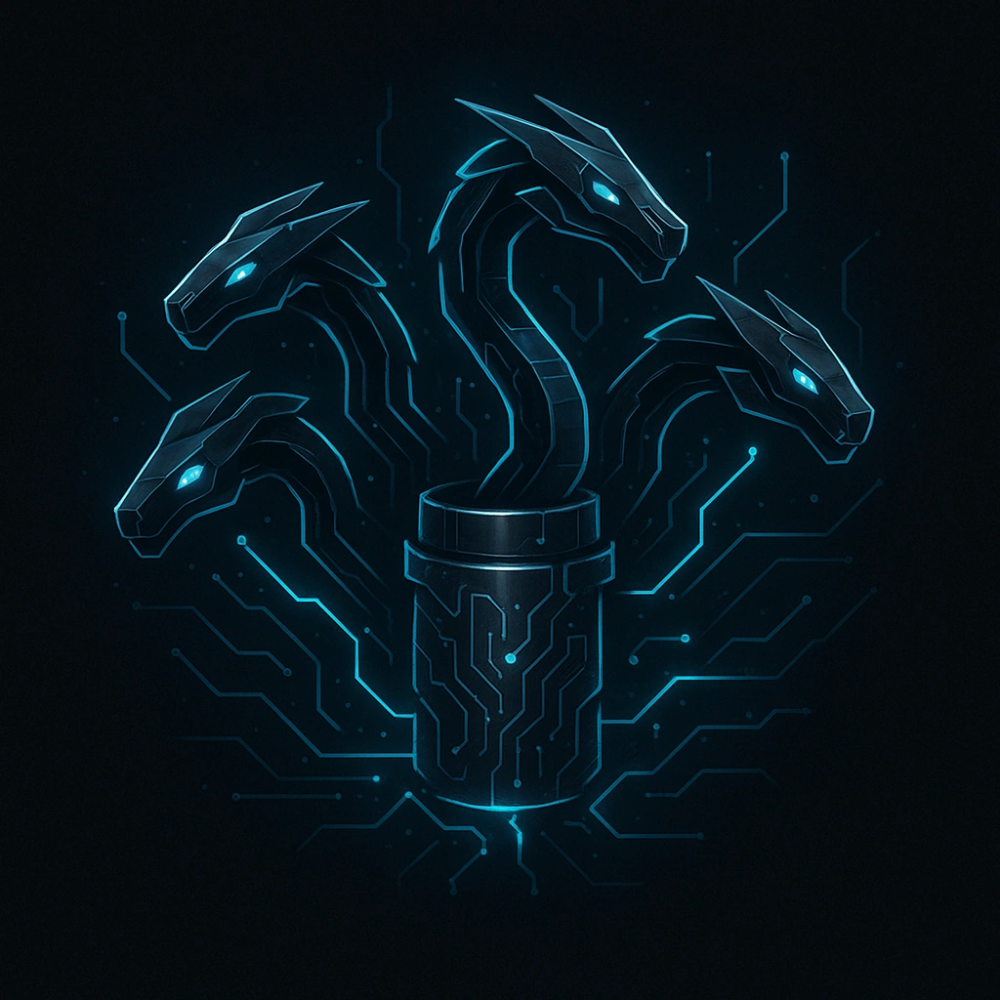

# Firewall Hydra

## Description
*<i>Cut off one head—wake three daemons.</i>  
Bypassing one layer spawns two new subroutines.
*

## Actions
- 
**Firewall Hydra** *Cut off one head—wake three daemons.

When this ICE is disabled, start 2 Countdown Trackers with a value of d6. When the hacker performs a Control action, decrement all Countdown Trackers by 1. Whenever a Firwall Hydra Countdown Tracker reaches 0, activate a new copy of this ICE*

---

features/Device Features/Wall ICE
 
**UUID:** `Compendium.cybermancy.system.firewall-hydra`

