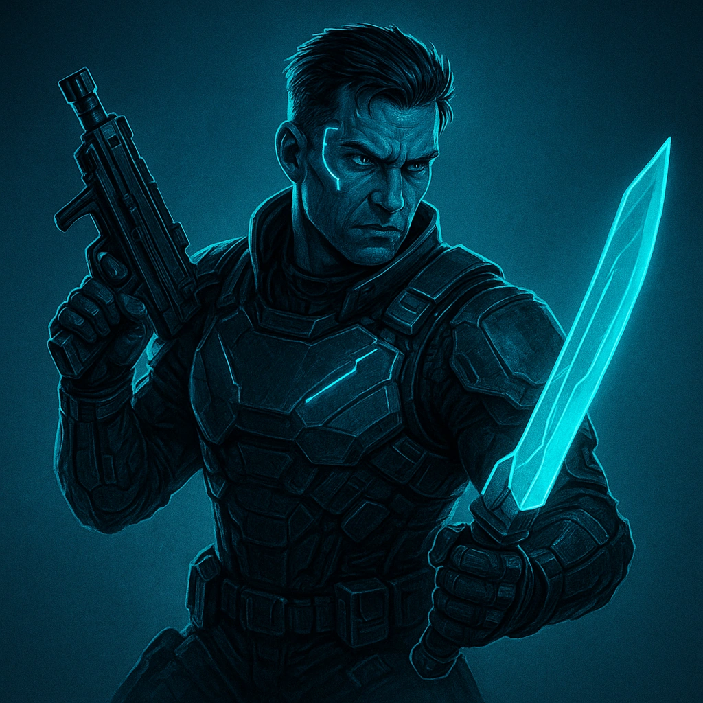

# Focused aggression

## Description
*
<strong>Spend 3 Hope</strong> to gain +2 to either all attacks made by Melee weapons or all attacks made by guns until the end of the Scene.
*

## Actions
- 
**Focused aggression** *Spend 3 Hope to gain +2 to either all attacks made by Melee weapons or all attacks made by guns until the end of the Scene.*

- 
**Focused aggression** *Spend 3 Hope to gain +2 to either all attacks made by Melee weapons or all attacks made by guns until the end of the Scene.*

---

features/Class and Subclass Features/Street Samuri
 
**UUID:** `Compendium.cybermancy.system.focused-aggression`

