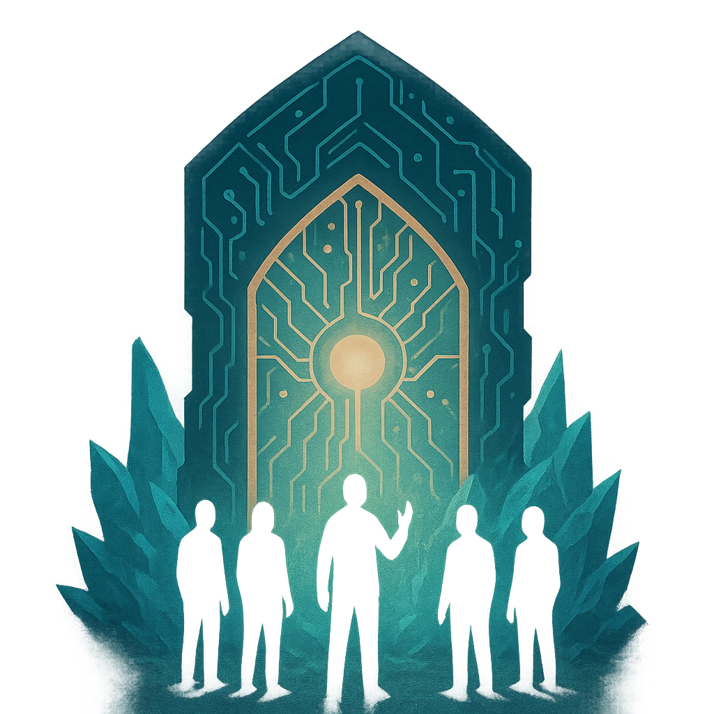

# Heaven’s Gate

## Description
*
<em>You don’t hack it—you plead your case.</em>  

Sentient ICE that negotiates, tempts, and judges intruders rather than simply blocking.

While active, this ICE requires that the hacker make a Knowledge or Presence check before making a Spellcasting (Hacking) check whenever attempting to disable this ICE or to perform a Control action on this device.

The effects of the Knowledge or Prescence rolls are the following:

<ul><li>
<strong>Critical success:</strong> The ICE is convinced that you should be here and aids you, +2 on all subsequent Spellcasting (Hacking) checks for the remainder of the Scene.
</li><li>
<strong>Success with Hope:</strong> The ICE is satisfied with your answer:  no penalty to your next Spellcasting (Hacking) check.
</li><li>
<strong>Success with Fear:</strong> The ICE is begrudgingly accepting of your answer:  -1 your next Spellcasting (Hacking) check.
</li><li>
<strong>Failure with Hope</strong>: The ICE is dissatisfied with your answer:  -2 your next Spellcasting (Hacking) check and advance the System Alert level by 1.
</li><li>
<strong>Failure with Fear</strong>: The ICE is very dissatisfied with your answer:  -4 your next Spellcasting (Hacking) check and advance the System Alert level by 2.
</li><li>
<strong>Critical Failure:</strong> The ICE is convinced that you are in the wrong:  no future Spellcasting (Hacking) attempts are allowed and advance the System Alert level to max.
</li></ul>

*

## Actions
- 
**Heaven’s Gate** *  no future Spellcasting (Hacking) attempts are allowed and advance the System Alert level to max.*

---

features/Device Features/Sentry ICE
 
**UUID:** `Compendium.cybermancy.system.heaven-s-gate`

