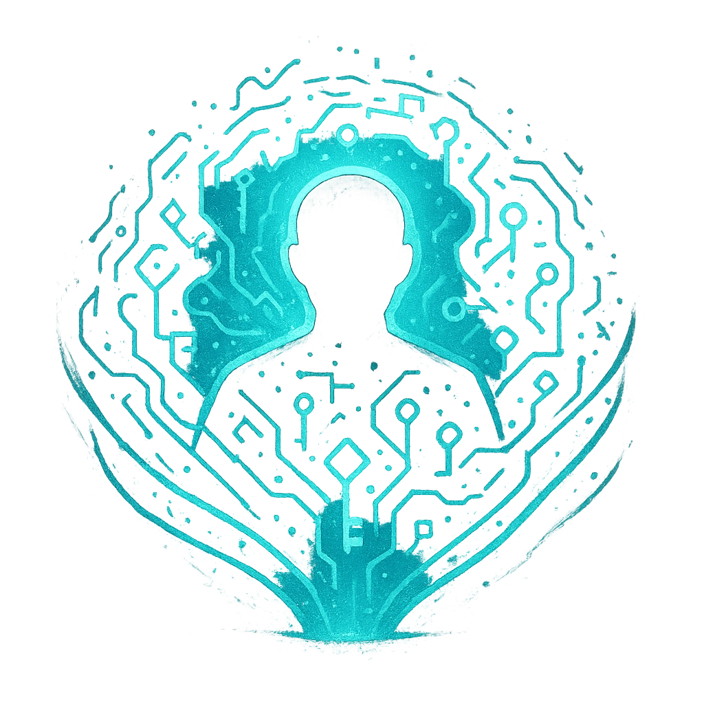

# Mana-Encryption Wave

## Description
*
You wrap allies in a shimmering data-shroud of sigils and encryption keys. 

Cost: Spend 3 Hope. 

Range: Close. 

Effect: Choose any number of allies within range. Until the end of the scene, each chosen ally increases their Major and Severe damage thresholds by an amount equal to your Spellcast trait (minimum +1).
*

## Actions
- 
**Mana-Encryption Wave** *You wrap allies in a shimmering data-shroud of sigils and encryption keys. 

Choose any number of allies within range. Until the end of the scene, each chosen ally increases their Major and Severe damage thresholds by an amount equal to your Spellcast trait (minimum +1).*

---

features/Class and Subclass Features/Razz Hacker
 
**UUID:** `Compendium.cybermancy.system.mana-encryption-wave`

