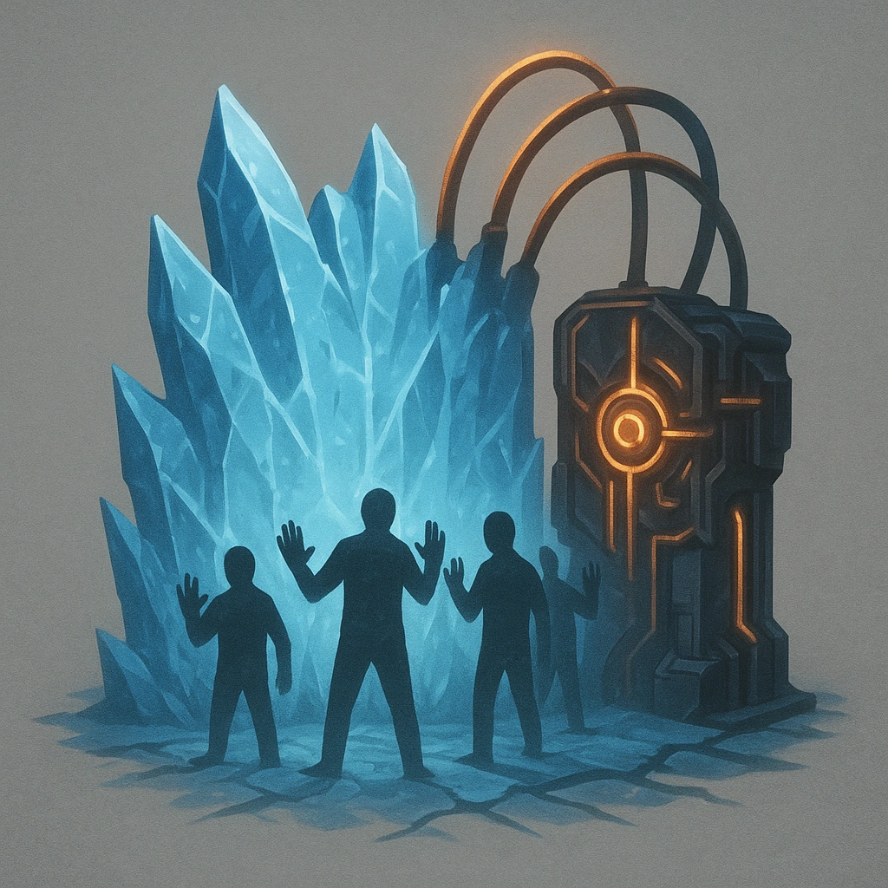

# Wall of No!

## Description
*
This is the simplest type of ICE and just tries to beat the runner into submission with audio stimulation and 1000 pop-up windows that all just say "NO!".

All subsequent ICE Difficulty is +3 unless this wall is disabled.
*

## Actions
—

---

features/Device Features/Wall ICE
 
**UUID:** `Compendium.cybermancy.system.wall-of-no`

