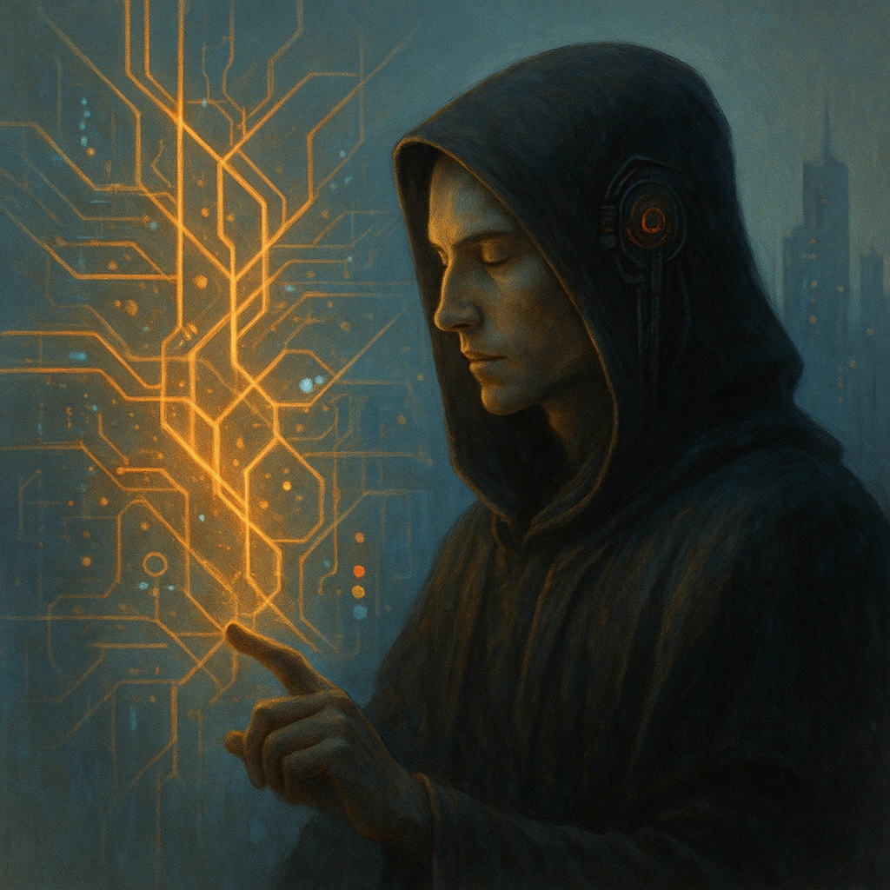

# Walkers

## Description
*
Some Neo Monks learn to read the city like a probability map: traffic lights, ley-lines, stock tickers, and spirit-omens all resolving into a single branching flowchart. These Razz Hackers are called Walkers—those who can see the road, and sometimes nudge which lane reality chooses.
*

Subclass

## Features
-   <a href='../../features/arcane-debugging/'><strong>Arcane Debugging</strong></a> — _Foundation_: 
You patch reality like bad code. 

At the start of each session, gain a number of Debug Tokens equal to your Finesse modifier (minimum 1). When a creature you can see makes an Instinct or Finesse roll, you may spend 1 Debug Token after the roll to let them reroll one die from that roll. (They must keep the new result.) You regain all spent Debug Tokens when you complete a long rest. 

As a short rest move, you may gain additional Debug Tokens equal to your Finesse modifier.

-   <a href='../../features/mana-phase-change-circuit/'><strong>Mana Phase Change Circuit</strong></a> — _Specialization_: 
-   <a href='../../features/pawning-the-past/'><strong>Pawning the Past</strong></a> — _Mastery_: 
You run a regression trace on a person’s timeline and spin up a “backup” memory state. 

Once per session, you may touch (or establish a secure comms link to) a willing creature and implant a false but plausible memory of a single recent event (no longer than a few minutes of lived experience). 

The memory feels real for 1028 seconds and then degrades over the next day; afterward, the target retains two conflicting recollections. The GM decides what concrete details can be changed, but this feature cannot erase oaths, remove Conditions, or undo harm—only alter what the target believes happened.

---

**UUID:** `Compendium.cybermancy.system.walkers`
subclasses
 

