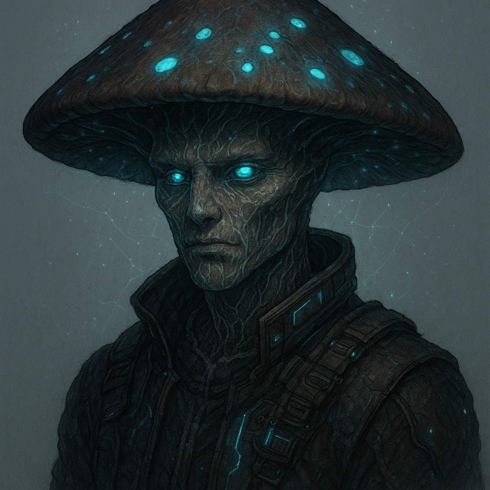
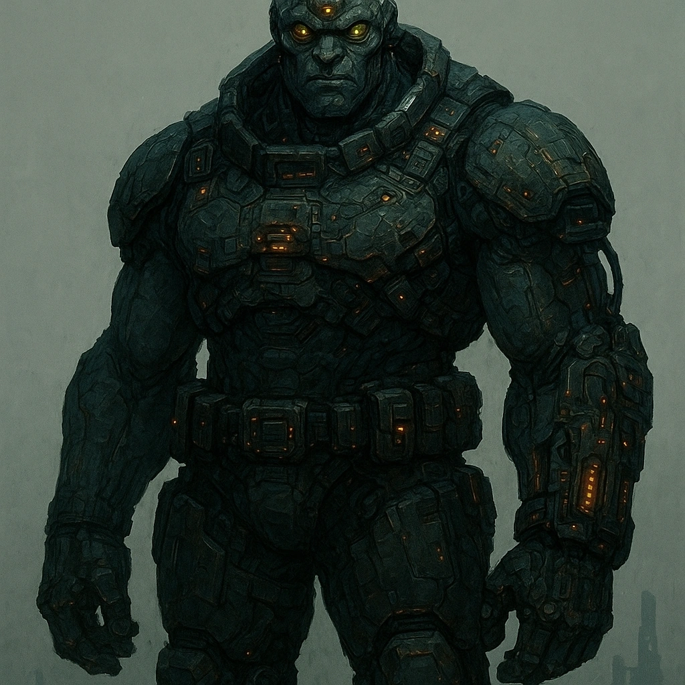
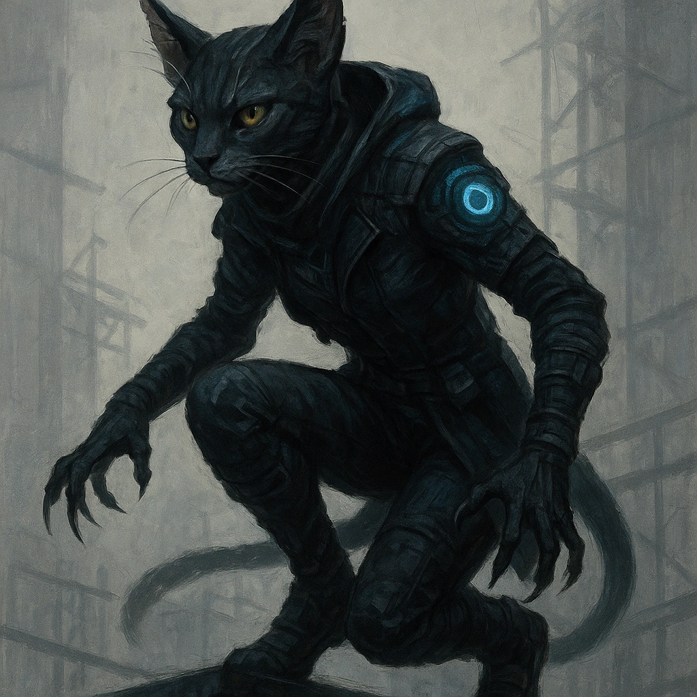
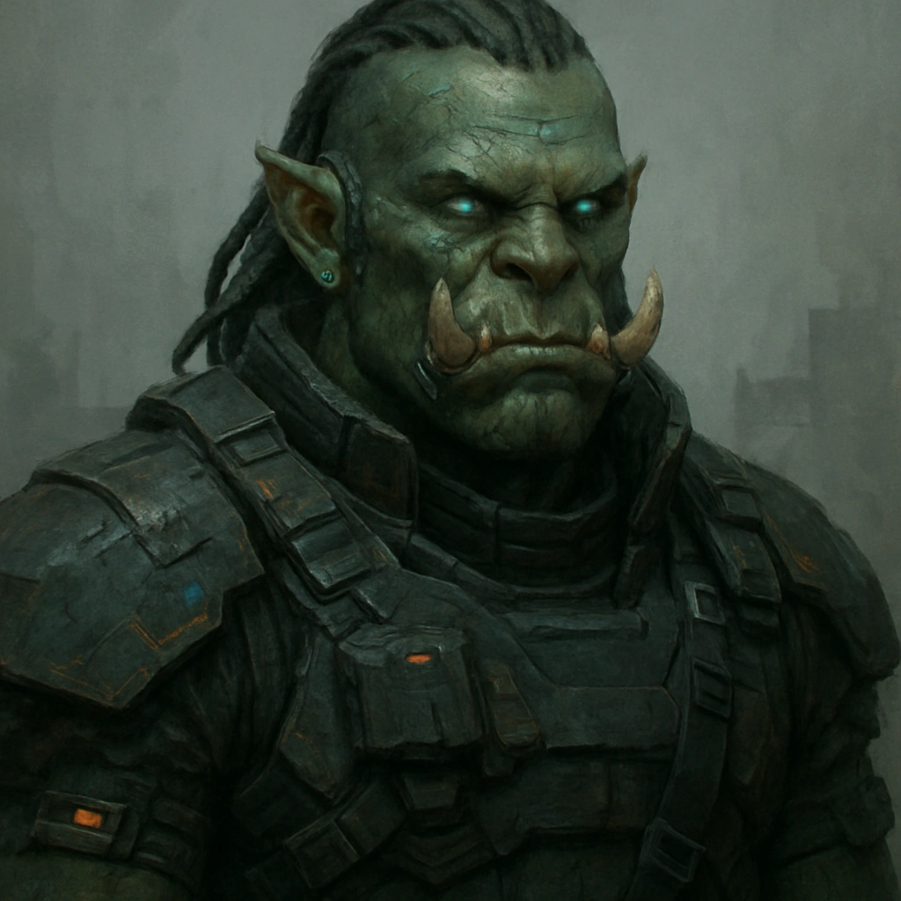

Below are Cybermancy-aligned rewrites of each ancstry; mechanics are kept the same; only the fiction and justification are adapted.

---

## Clank (Cybermancy)

Clanks are sentient synthetic beings: chassis of metal, composite, or bio-ceramic animated by cognition cores and Resonance-charged architecture. Some resemble humanoids, others mimic animals, drones, or industrial tools; their frames are often custom-built for a role—logistics, security, medical, data handling, war. Many clanks are corporate products, military surplus, or black-lab experiments that found or seized their autonomy. Others are “inheritance shells,” bodies built for uploaded minds or emergent AIs birthed in the Prometheus Cloud. As long as they can source spare parts, power, and core maintenance, a clank’s body is effectively immortal. Their cognition, however, degrades over time from memory fragmentation, core drift, or Resonance interference, giving age an unusual meaning among their kind.

**Features**
**Purposeful Design:** Decide who built you and why (corp line, rebel engineer, Cabal lab, etc.). At character creation, choose one of your Experiences that fits that intended purpose and gain a permanent +1 bonus to it.
**Efficient:** Your systems optimize downtime. When you take a short rest, you can choose a long rest move instead of a short rest move.

---

## Drakona (Cybermancy)

Drakona are engineered descendants of draconic gene-lines: tall, scaled humanoids with dense bone structure and specialized organ clusters. Their scales are composite bio-armor, tuned to disperse impact and environmental stress. Corporations and cults alike have used drakona programs to create living weapons, environmental shock-troops, or status symbols. Each bloodline carries a stabilized “elemental” organ—nanothermal furnaces, charged gland-clusters, cryogenic sacs—manifesting as devastating breath attacks. Most inherit their family’s elemental profile, but Resonance anomalies and off-protocol experimentation sometimes give rise to rare variants.

**Features**
**Scales:** Your dermal plating is natural armor. When you would take Severe damage, you can **mark a Stress** to mark 1 fewer Hit Points.
**Elemental Breath:** Choose an element (electricity, fire, ice, corrosive mist, etc.). You can exhale this against a target or group within Very Close range, treating it as an Instinct weapon that deals **d8** magic damage using your Proficiency.

---

## Dwarf (Cybermancy)

Dwarves are compact, dense-framed humanoids adapted to high-stress environments: mines, reactors, undercity infrastructure, and industrial platforms. Their tissues are rich in keratin and mineralized fibers, giving them durable skin, nails, and bones. Many dwarves embed metal, gemstones, or circuitry into their bodies as permanent adornment or functional upgrades. Their musculature and mass age slowly; an older dwarf may carry decades of strain and exposure while remaining physically formidable. Dwarven communities often cluster around core infrastructure—power grids, transit hubs, fabrication stacks—where their patience and technical discipline are highly valued.

**Features**
**Thick Skin:** You naturally blunt minor harm. When you take Minor damage, you can **mark 2 Stress** instead of marking a Hit Point.
**Increased Fortitude:** **Spend 3 Hope** to halve incoming physical damage as you brace, set your stance, or harden your body against impact.

---

## Elf (Cybermancy)

Elves are long-lived post-human morphs with heightened sensory and neural attunement to the altered world. Tall and fine-featured, they are known for their pointed ears and precise perception. Instead of typical sleep, elves enter a structured trance that integrates memory consolidation, metabolic rest, and—often—Resonance echo processing. Many elves adapt physically to the domains they devote themselves to: urban light halos, bioluminescent freckling, circuitry-like veining, ember-bright eyes, or leaf-and-vine hair. These “mystic forms” can shift slowly over centuries as an elf changes environment, allegiance, or discipline.

**Features**
**Quick Reactions:** Your nerves are tuned for sudden shifts. **Mark a Stress** to gain advantage on a reaction roll.
**Celestial Trance:** During a rest, you can drop into a focused trance, allowing you to choose an additional downtime move.

---

## Faerie (Cybermancy)

Faeries are winged, insectile post-humans—products of radical bioengineering, Resonance-driven mutation, or ancient gene-cults. Their bodies range from mostly humanoid with chitin highlights to almost fully insectoid, featuring compound eyes, extra limbs, bioluminescent organs, stingers, and exoskeletal plating. All faeries undergo a metamorphic phase where their adult form “locks in,” often accompanied by intense psychological and sensory reconfiguration. Their wings, though fragile-looking, are responsive to fine-grained energy fluctuations, making them agile and unpredictable in three dimensions.

**Features**
**Luckbender:** Reality seems to warp around your choices. Once per session, after you or a willing ally within Close range makes an action roll, you can **spend 3 Hope** to reroll the Duality Dice.
**Wings:** You can fly. While flying, you can **mark a Stress** after an adversary makes an attack against you to gain a +2 bonus to your Evasion against that attack.

---

## Faun (Cybermancy)

Fauns are goatlike morphs designed or adapted for mobility in broken terrain—shattered cities, cliffside settlements, elevated rail systems, and scaffold jungles. Their bodies mix humanoid torsos with digitigrade legs, cloven hooves, and a wide range of horn shapes. Long limbs and precise balance make them effective climbers, brawlers, and urban freerunners. Over a long lifespan, many fauns lean further into their caprine traits through selective gene-tuning or incremental bio-mods, gaining heavier horns, thicker fur, or more robust frames.

**Features**
**Caprine Leap:** Your legs are built for powerful jumps. You can leap anywhere within Close range as though using normal movement, vaulting obstacles and crossing gaps with ease.
**Kick:** When you succeed on an attack against a target within Melee range, you can **mark a Stress** to launch a brutal kick, dealing an extra **2d6** damage and knocking back either yourself or the target to Very Close range.

---

## Firbolg (Cybermancy)

Firbolgs are bovine humanoids built for power and presence. Broad frames, horn structures of many shapes, and heavy musculature make them natural shock troops, load-handlers, or linebreakers in both corporate and independent forces. Their fur can be muted or strikingly patterned, often reflecting the aesthetic of the culture or corp that shaped their lineage. Firbolgs are frequently deployed where raw strength and physical intimidation matter—blockade enforcement, riot control, or heavy industrial work—though many turn that same power toward community defense or mercenary work far from their origins.

**Features**
**Charge:** When you succeed on an Agility Roll to move from Far or Very Far into Melee range with one or more targets, you can **mark a Stress** to deal **1d12** physical damage to all targets within Melee range as you crash through them.
**Unshakable:** Your frame absorbs strain. When you would mark a Stress, roll a **d6**. On a 6, don’t mark it.

---

## Fungril (Cybermancy)

Fungril are fungal humanoids: ambulatory growths formed from dense mycelial networks intertwined with human or near-human architectures. Their bodies vary widely in color, composition, and silhouette—from subtle moss-backed forms to towering caps with luminous gills. Many maintain underground or substrate-level networks that allow long-distance chemical and quantum-signature communication between fungril clusters. Their extended lifespans are a byproduct of distributed cognition; individual bodies may wither, but the network persists, preserving memory in spore archives and mycelial “databanks.”

**Features**
**Fungril Network:** Your mycelial array is a long-range communication mesh for your kind. Make an **Instinct Roll (12)** to contact others of your ancestry across any distance. On a success, you can exchange information.
**Death Connection:** While touching a corpse that died recently, you can **mark a Stress** to extract one memory tied to a specific emotion or sensation of your choice.

---

## Galapa (Cybermancy)

Galapa are turtlelike humanoids built for endurance and protection in hazardous zones: high-radiation districts, industrial waste belts, and volatile frontlines. Their shells are dense composite structures that blend bone, keratin, and sometimes bioceramic plating. Many galapa carve stories, sigils, or tactical markings into their shells, or reinforce them with attached armor segments. Their natural pace is deliberate and measured, but their resilience in the face of environmental and kinetic threats makes them valuable in sieges, evacuations, and long-haul operations in unsafe regions.

**Features**
**Shell:** Your shell is a living shield. Gain a bonus to your damage thresholds equal to your Proficiency.
**Retract:** **Mark a Stress** to retract into your shell. While inside, you have resistance to physical damage, disadvantage on action rolls, and cannot move.

---

## Giant (Cybermancy)

Giants are macro-scale humanoids bred or engineered for reach, leverage, and battlefield or industrial presence. Ranging from 6½ to 8½ feet, with long arms and thick frames, they excel at tasks where mass and extension matter: heavy construction, high-clearance security, and open-field engagements. Many giants feature unusual ocular development—two or three eyes, or a centralized single eye—linked to depth perception or resonance-adaptive vision systems. Their growth is fast, their lifespan comparatively short, and their impact on any scene is immediate.

**Features**
**Endurance:** Your frame is built to take punishment. Gain an additional Hit Point slot at character creation.
**Reach:** Your size extends your threat radius. Treat any weapon, ability, spell, or other feature with Melee range as though it has Very Close range instead.

---

## Goblin (Cybermancy)

Goblins are small, hyper-perceptive humanoids with oversized eyes and ears tuned for low light, noise, and signal anomalies. They thrive in cramped infrastructure, sensor-shadowed alleys, vent networks, and overloaded control rooms. Goblins often work as riggers, scavengers, spotters, or sabotage specialists, reading subtle shifts in sound and motion where others see only chaos. Ear posture and eye focus serve as a sophisticated nonverbal language, allowing tight teams to coordinate without speech across noisy or surveilled environments.

**Features**
**Surefooted:** You ignore disadvantage on Agility Rolls, darting through clutter and unstable footing with ease.
**Danger Sense:** Once per rest, **mark a Stress** to force an adversary to reroll an attack against you or an ally within Very Close range.

---

## Halfling (Cybermancy)

Halflings are small, sturdy humanoids well suited to life in dense urban blocks, transit corridors, and orbital or undercity habitats. Their compact size, strong legs, and keen senses make them excellent navigators of both physical and social environments. Halflings are known for an uncanny directional sense; many attribute it to subtle sensitivity to electromagnetic gradients, power-lines, and geo-resonant patterns. Their communities often form tight-knit enclaves that double as safe houses, smuggling routes, or mutual-aid networks, depending on local pressures.

**Features**
**Luckbringer:** Your presence steadies the group. At the start of each session, everyone in your party gains a Hope.
**Internal Compass:** When you roll a 1 on your Hope Die, you can reroll it as your instincts reorient you.

---

## Human (Cybermancy)

Humans are the baseline reference point in a world that has long since moved past “baseline” as a norm. Their bodies are adaptable and broadly compatible with augmentations, from simple cybernetics to complex bioware suites. Humans occupy every layer of society: exec tiers, street crews, research stacks, nomad convoys, and undercity warrens. While they lack inherent exotic traits, their strength lies in flexibility—quick to learn, quick to improvise, and often overlooked until they have already shifted the local balance of power.

**Features**
**High Stamina:** You are used to pushing yourself. Gain an additional Stress slot at character creation.
**Adaptability:** When you fail a roll that used one of your Experiences, you can **mark a Stress** to reroll.

---

## Infernis (Cybermancy)

Infernis are horned, sharp-featured humanoids whose lineage has been touched by deep Resonance fields, demonic memetics, or old-world pacts bound into bloodlines. Their skin, hair, and horns come in dramatic hues, often mirroring the energies or cult aesthetics that shaped their ancestry. Many infernis manifest a “dread visage”—a transient, amplified form triggered by fear, rage, or deliberate intimidation, where their features distort, eyes flare, and shadows cling unnaturally. Some corp and Cabal programs have tried to weaponize this trait; most infernis simply learn to live with how the world reacts to their presence.

**Features**
**Fearless:** You are practiced at channeling terror into resolve. When you roll with Fear, you can **mark 2 Stress** to change it into a roll with Hope instead.
**Dread Visage:** Your warped presence unnerves others. You have advantage on rolls to intimidate hostile creatures.

---

## Katari (Cybermancy)

Katari are feline humanoids optimized for stealth, balance, and rapid response. Their bodies may lean more human or more catlike, but all feature retractable claws, sensitive whiskers, and highly mobile ears that track sound with precision. Katari thrive in vertical spaces and sensor-shadowed zones: scaffold jungles, ductwork, rooftop warrens, and neon-slashed alleys. Corporate security teams, independent crews, and gang circles all value katari scouts and infiltrators, though many choose to live far from anyone who would treat them as tools.

**Features**
**Feline Instincts:** Your reflexes sharpen in motion. When you make an Agility Roll, you can **spend 2 Hope** to reroll your Hope Die.
**Retracting Claws:** Make an **Agility Roll** to scratch a target within Melee range. On a success, they become temporarily Vulnerable as your claws find weak points.

---

## Orc (Cybermancy)

Orcs are powerfully built humanoids distinguished by prominent tusks, heavy jaws, and square features. Their bodies are naturally suited to close-quarters conflict, heavy labor, and high-impact physical work. Many orc communities have histories tied to security contracts, pit-fighting circuits, industrial unions, or resistance movements that weaponize their reputation for toughness. Tusks are often engraved, capped, or wired with minor implants, serving simultaneously as cultural markers, intimidation tools, and personal history.

**Features**
**Sturdy:** You refuse to fall easily. When you have 1 Hit Point remaining, attacks against you have disadvantage.
**Tusks:** When you succeed on an attack against a target within Melee range, you can **spend a Hope** to gore them with your tusks, dealing an extra **1d6** damage.

---

## Ribbet (Cybermancy)

Ribbets are amphibious humanoids adapted to waterways, flooded districts, and wet infrastructure—sewers, reclamation channels, aquifer systems, and coastal slums. Their smooth, moist skin, webbed extremities, and wide-set eyes give them excellent aquatic mobility and awareness. They move by hopping and gliding through space, whether across broken pavement or through submerged passages. Some ribbets show camouflage palettes that blend into algae-stained concrete and rust; others display vivid warning colors that are hard to forget.

**Features**
**Amphibious:** You can breathe and move naturally underwater, treating it as a familiar environment.
**Long Tongue:** You can use your tongue to grab objects within Close range. **Mark a Stress** to use your tongue as a Finesse Close weapon that deals **d12** physical damage using your Proficiency.

---

## Simiah (Cybermancy)

Simiah are simian humanoids built for dynamic movement and manipulation in complex environments: high-rise scaffolds, cable forests, ruined megastructures, and transit superstructures. Their long limbs, strong hands and feet, and sometimes prehensile tails give them multiple points of contact and control. Simiah communities often grow around vertical spaces where others struggle—stacked shanties, tower farms, antenna forests—turning difficult terrain into home. Their ability to move from ground to wall to ceiling in one fluid sequence makes them invaluable in infiltration, rescue, and maintenance roles.

**Features**
**Natural Climber:** Your body is tuned for verticality. You have advantage on Agility Rolls that involve balancing and climbing.
**Nimble:** Your constant motion refines your defenses. Gain a permanent +1 bonus to your Evasion at character creation.

