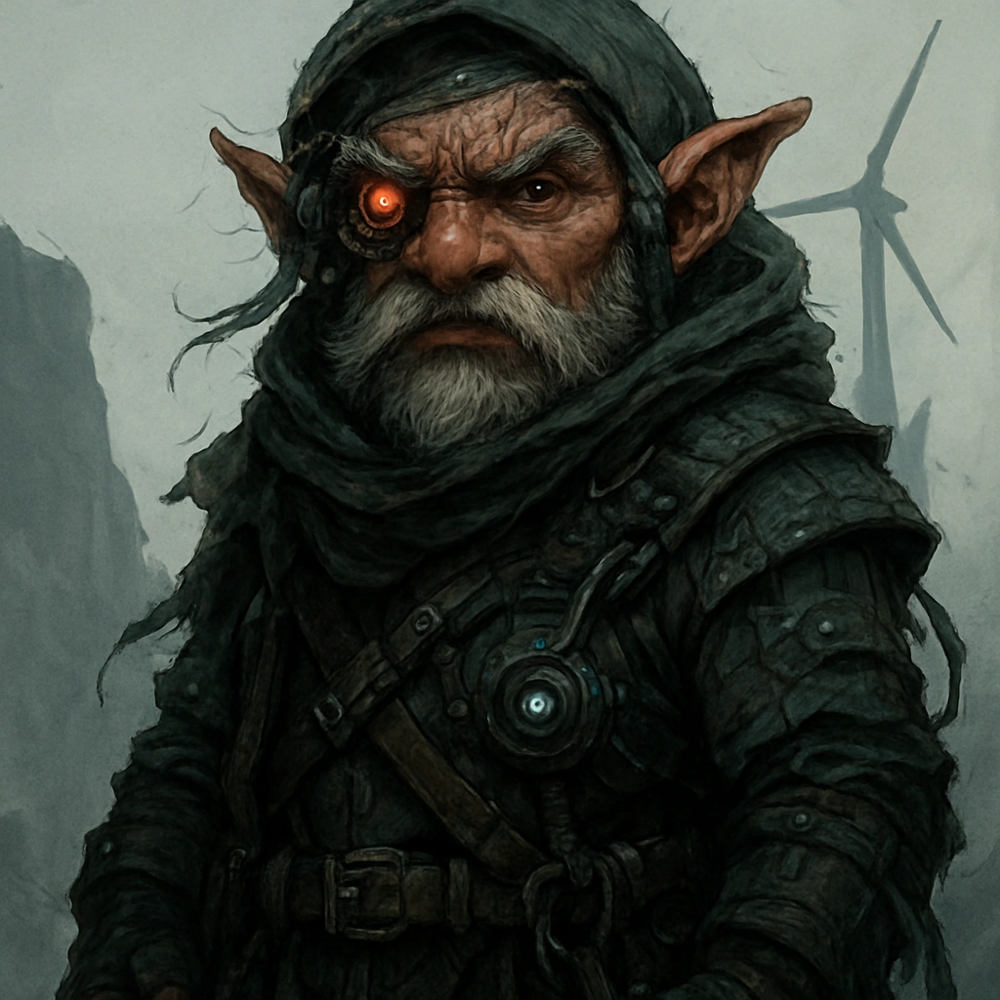

# Cybermancy Communities

Each of the original Daggerheart communities exist in the Cybermancy world, but are altered and updated accordingly.

---

## **Executiveborn**

Executiveborn trace their origins to the insulated enclaves of corporate aristocracy. Their families occupy the upper tiers of Council governance, independent boardrooms, and influential shareholder courts. Wealth is measured less in currency and more in access: private AI adjudicators, proprietary bio-patents, orbital residences, and controlled stakes in automated production. These environments shape a culture fluent in negotiation, market posturing, and reputation-driven power.

Executiveborn communities exhibit rigid hierarchies. Advancement is slow, often requiring political leverage or demonstrated strategic value. Their presence can stabilize a region through decisive resource allocation—or destabilize it through economic pressure. Most Executiveborn grow up shielded from scarcity, educated in curated academies, and surrounded by contract security.

**Community Feature — Privilege**
You have advantage when interacting with high-status individuals, negotiating prices, or using your reputation to secure access or favorable treatment.

---

## **Databorne**

Databorne emerge from institutions where information is both resource and doctrine. Their communities form around research arcologies, codex archives, political analysis bureaus, or independent think-tanks. Some serve under Council agencies devoted to data strategy, while others work within private foundations that assemble knowledge for profit, influence, or survival.

These groups prioritize structured inquiry and systems thinking. A Databorne upbringing often includes exposure to advanced neural interfaces, archival networks, and predictive modeling tools. While some enclaves maintain strict isolation to protect their research, others operate as diplomatic hubs where information is traded as currency.

**Community Feature — Well-Read**
You have advantage on rolls involving history, corporate politics, regulatory structures, or the cultural background of significant places or factions.

---

## **Directiveborn**

Directiveborn communities hold themselves together through shared principles—religious doctrine, operational codes, mutual-aid ethics, or martial discipline. Many originate from megacorp security academies, paramilitary orders, or Helios-aligned ideologue circles. Others form around civic defense coalitions or industrial guilds that enforce strict internal standards.

Their strength lies in collective purpose. Directiveborn internalize procedures designed to create predictability under pressure and unity in conflict. Some communities maintain a peaceful mission, focusing on rescue operations or humanitarian logistics. Others train specialists expected to operate in combat zones, corporate disputes, or hazardous territories.

**Community Feature — Dedicated**
Record three principles, mottos, or operational directives from your upbringing. Once per rest, when you act in accordance with one of them, you may roll a **d20** as your Hope Die.

---

## **Skyborne**

Skyborne descend from settlements built along cliffs, high mesas, wind-turbine forests, or stratospheric platforms. These regions develop out of necessity: resource extraction sites, atmospheric labs, radio-relay towers, or high-elevation trade links. Local communities specialize in navigation, climbing, environmental tolerance, and maintenance of machinery exposed to severe weather.

Life at altitude fosters resilience. Skyborne learn to manage thin air, unstable footing, and sudden storms. Many develop practical skills in rigging, turbine repair, and cargo transfer across hazardous terrain. Their homes are difficult to invade and equally difficult to escape, creating a culture that values both vigilance and self-reliance.

**Community Feature — Steady**
You have advantage on rolls to cross dangerous terrain, survive extreme weather, or apply environmental and survival expertise.

---

## **Currentborn**

Currentborn hail from the world’s waters: floating slums, corporate ocean platforms, kelp-farm chains, port cities, and deep-sea arcologies. Their communities rely heavily on maritime trade routes, submersible operations, and environmental monitoring systems altered by The Event. Many inhabitants learn seamanship from childhood, including navigation, salvage, and pressure management.

These cultures depend on the movement of tides, markets, and migrating ecosystems. Storm patterns, supply convoys, and shifting territorial claims influence daily life. Currentborn often act as intermediaries between coastal cities and offshore industries, carrying news, goods, and risks.

**Community Feature — Know the Tide**
When you gain Fear, place a token on your community card (up to your level). Before an action roll, you may spend any number of tokens for a +1 bonus each. Unspent tokens clear at the end of the session.

---

## **Streetborn**

Streetborn grow within networks that exist outside sanctioned structures: smuggling rings, darknet brokerages, illicit marketplaces, and street crews. These communities form wherever surveillance is weak or corruption strong—abandoned transit hubs, tunnel warrens, neglected districts, or encrypted virtual spaces. Their survival depends on adaptability, intuition, and a deep understanding of how systems fail.

Members typically master a range of unsanctioned skills: document forgery, covert movement, data laundering, and factional diplomacy. Despite appearances, these societies often follow strict internal codes, and breaches of trust carry severe consequences.

**Community Feature — Scoundrel**
You have advantage on rolls involving criminal negotiation, lie detection, or locating safe havens within the urban sprawl.

---

## **Substrataborn**

Substrataborn originate in the infrastructural depths beneath cities—maintenance warrens, reactor tunnels, repurposed storm systems, and collapse zones. Some communities descend even further into cavern networks shaped by seismic shifts or biotechnological growth. Life in these regions requires ingenuity and quiet resilience.

Their engineering skill is renowned, driven by necessity and constant exposure to malfunctioning systems, unstable architecture, and subterranean fauna. Many Substrataborn communicate using silent gestures or light-pulse languages to compensate for loud machinery, poor acoustics, or security risks.

**Community Feature — Low-Light Living**
You have advantage on rolls to hide, investigate, or perceive details in areas of low light, shadow, or partial darkness.

---

## **Nomadborn**

Nomadborn communities move continually through fractured landscapes—convoys crossing wastelands, sky-truck caravans drifting between megacities, rigger tribes migrating with market cycles, or data-courier bands traveling mesh-tether routes. Their survival depends on adaptability, cooperation, and careful management of supplies.

They are shaped by exposure to varied cultures and shifting jurisdictions. Nomadborn learn the value of temporary alliances and portable skills. Most travel in groups bound by shared ideals or shared loss, and they develop strong internal loyalty born from years of mutual risk.

**Community Feature — Nomadic Pack**
Add a Nomadic Pack to your inventory. Once per session, spend a Hope to pull out a mundane, situationally useful item. Determine the exact item with the GM.

---

## **Greenborn**

Greenborn inhabit reclaimed forests, feral biomes, bioengineered growth zones, and isolated ecological communes. These environments mix natural regrowth with synthetic biology—luminescent canopies, vine-woven dwellings, and fauna adapted through post-Event mutation. Settlements are designed to integrate with the environment rather than bend it to human will.

Greenborn traditions emphasize ecological awareness, long-term sustainability, and careful coexistence with altered species. Many demonstrate exceptional tracking ability and near-silent movement across dense terrain. Their perspective is shaped by both the beauty and volatility of living ecosystems.

**Community Feature — Lightfoot**
Your movement is naturally quiet. You have advantage on rolls made to avoid being heard.

