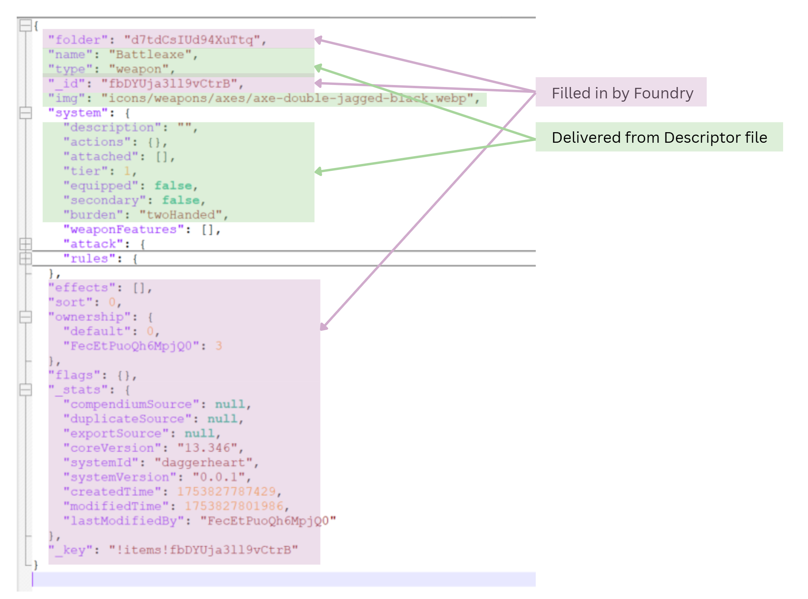
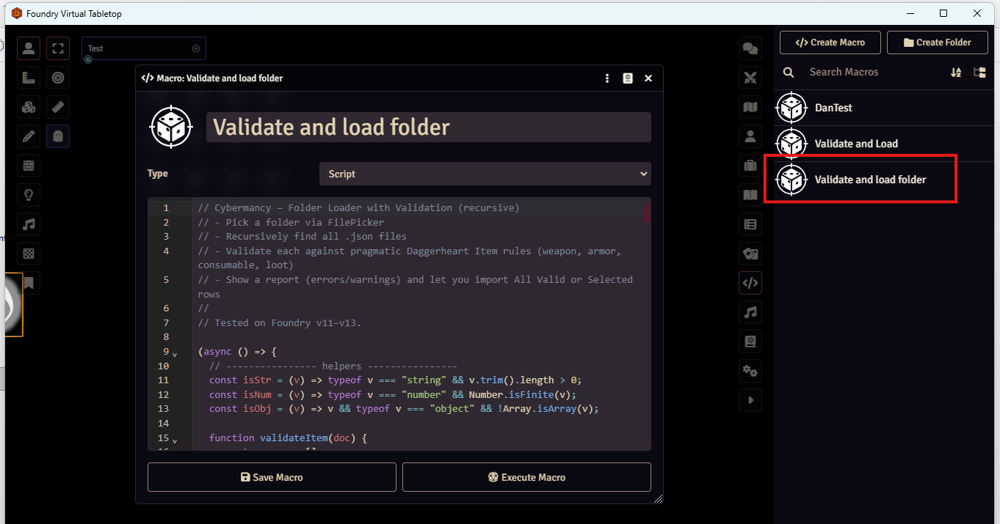
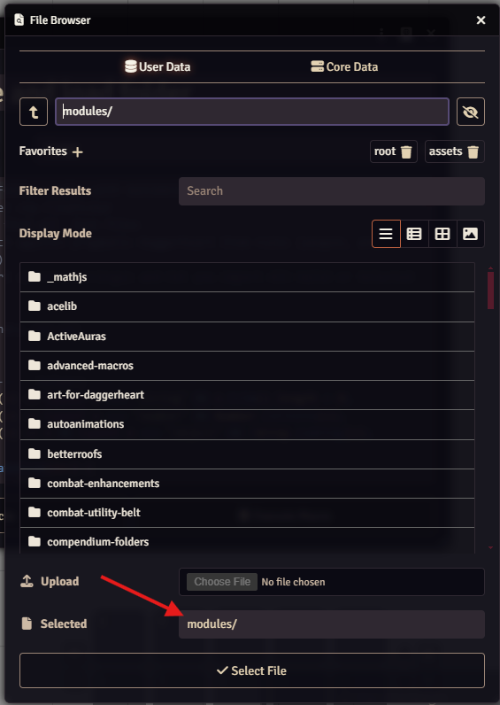

# 🧠 Cybermancy Project Index (GPT Notes)

*A Foundry VTT system and world-building project extending Daggerheart into a cyberpunk / Shadowrun-style RPG.*

---

## 🎯 Project Overview

**Goal:**  
Create a modular Foundry VTT extension for *Daggerheart*—the **Cybermancy** system—with features including:

- Custom sheets, item types, and rule extensions (Edge economy, cyberware, netrunning)  
- A comprehensive content compendium (weapons, armor, programs, NPCs)  
- Automated pipelines: JSON → Foundry compendia & JSON → player website  
- Continuous release and update capability via GitHub  

**Primary Repository:**  
[knightweaver/cybermancy](https://github.com/knightweaver/cybermancy)

**Current Version:** `v0.0.4`  
**Foundry Compatibility:** Core v11–13  
**Base System:** Daggerheart (by Foundryborne)

---

## 🗂 Active Workstreams

| Thread | Purpose | ChatGPT Link | Repo / Docs Path |
|---|---|---|---|
| **System Design** | Core mechanics, data models, rules schema | *[Chat link]* | `/system/` |
| **Foundry Code** | JS/TS implementation, custom sheets, roll logic | *[Chat link]* | `/scripts/`, `/templates/` |
| **Content Development** | Weapons, armor, cyberware, NPCs, lore | *[Chat link]* | `/src-data/`, `/packs/` |
| **ETL & Web Export** | JSON → compendia + website generation | *[Chat link]* | `/tools/etl/`, `/web/` |
| **Release Process** | Packaging, versioning, GitHub Actions, manifest updates | *[Chat link]* | `.github/workflows/` |
| **Worldbuilding / Lore** | Factions, setting, NPCs, story arcs | *[Chat link]* | `/docs/lore/` |

> Replace `*[Chat link]*` with the shareable URL of each ChatGPT thread.

---

## Key Observations and General Approach

### Direct load into .ldb (or even .db) is a _non-starter!_

 - **Export Data / Import Data doesn't work**:
 * * the Export Data / Import Data feature in Foundry VTT does not work to preserve an item.  Even just exporting a item and directly re-importing the very same JSON block does not work.
 - **Weapon Features can only be from internal to DH system**: 
 * * Weapon features cannot be created or internally references within the JSON - only features known from the Daggerheart system can be referenced by name:

```angular2html
    "weaponFeatures": [
      {
        "value": "cumbersome"
      }
    ],
```
 - **\_key and \_id are best generated from within Foundry VTT**:
 * * I tried various approaches to generating these ids and keys via .mjs code, but the resulting files were never correctly picked up by Foundry.
 - **You gotta use a Foundry Macro to create objects within Foundry**

### Successful approach: minimal descriptor file and Foundry Macro.

 - Generate a subbed out python script, convert-descriptors-to-loadable.py, that consumes a JSON or .csv descriptor file (the .csv is for multiple objects and is the default, but the script accept single or multiple .JSON files as well).
 - The main complexity of generating a loadable JSON file is that "simple" characteristics of an item, loot, etc. can be buried in the JSON (for example "cost"), so the approach is a standard subbed block in python, and then named JSON blocks for actions (and effect if needed).
 - Here's an illustration of how things map:



---

# Instructions to make a new item

1. Add an entry to the appropriate item .csv file (e.g. weapons.csv)
2. run the convert-descriptors-to-loadable.py 
3. Go into Foundry in the Cybermancy builder World and run the _Validate and load folder_ macro.  **REMINDER**: the File Browser in Foundry that is being evoked doesn't auto select the folder correctly.  You have to type it in (see screenshot below).
4. (The new items show up in the Items, so you have to drag and drop them into the right Compendium)
5. If you need a new Action:
6. 1. Generate it in Foundry through the interface on a dummy Item (or Actor, whatever)
7. 2. Use Export Data on the right-click menu option on the Items list
8. 3. Add the "action" JSON segment to the actions-by-category.json JSON file with an appropriate name.



Reminder: you have to type in the folder name:



---

## 🧮 Build & Packaging Commands

Note that the https://github.com/foundryvtt/foundryvtt-cli package is also still useful, but only after the load via the Foundery macro.

This can be used to "unpack" a module, make changes to the output JSON files, and then repack.  The preserves all the keys, ids, folders, etc.


